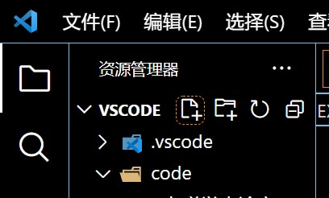
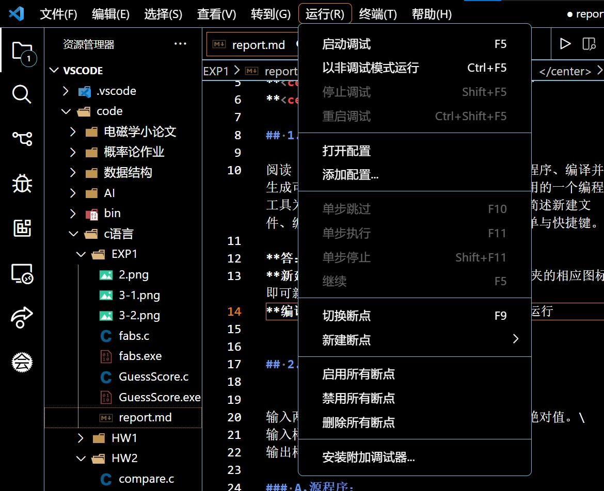
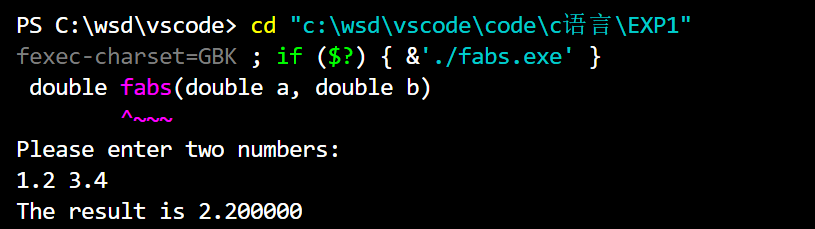
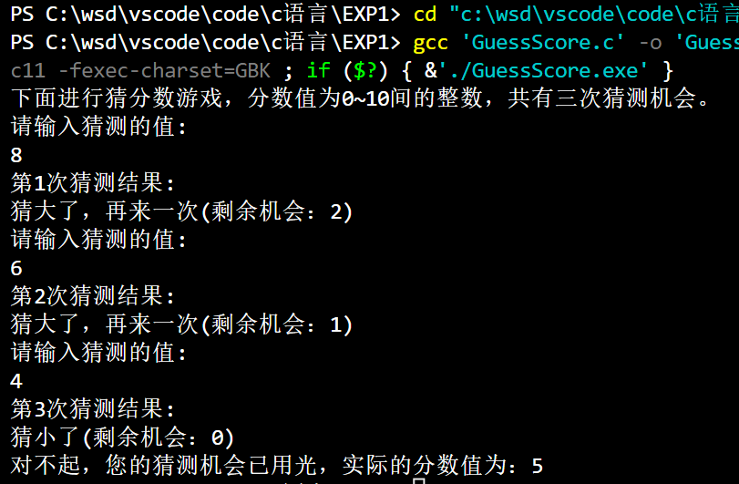
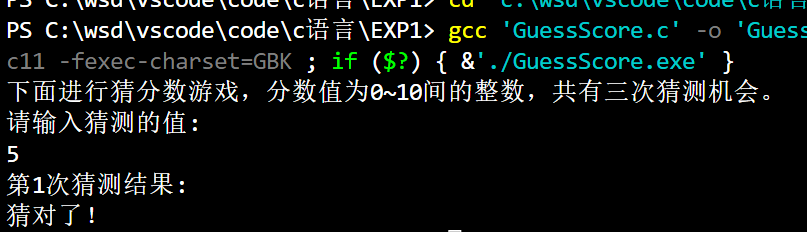

# <center>程序设计上机实验【1】</center>

**<center>《熟悉实验环境及简单程序设计》</center>**

**<center>王世炟 PB20151796</center>**
**<center>2022/09/29</center>**

## 1. 

阅读《实验指导书》第一章，了解怎样编辑源程序、编译并生成可执行程序、运行可执行程序。以你所使用的一个编程工具为例, 如Code::Blocks或者DevC++等，简述新建文件、编译生成、运行程序的操作方法，包括菜单与快捷键。

**答：** 本人采用的编译器为VScode。\
**新建文件：** 点击资源管理器下方工作文件夹的相应图标即可新建文件。\


**编译生成&运行程序：** 按`Ctrl+F5`或点击上方运行菜单中的以非调试模式运行即可\



## 2. 编程序完成以下任务：


输入两个实数，计算并输出这两个实数的差的绝对值。\
输入样例：1.2  3.4\
输出样例：2.200000

### A.源程序：

```
# include <stdio.h>

double fabs(double a, double b)
{
    double result = b - a;
    if (result < 0 )
    {
        result = -result;
    }
    return result;
}

int main()
{
    double a, b, result;
    printf("Please enter two numbers:\n");
    scanf("%lf %lf", &a, &b);
    result = fabs(a, b);
    printf("The result is %lf", result);
    //printf("The result is %lf\n", a>b?a-b:b-a);//三目运算符一行代码即可实现
    return 0;
}
```

### B.运行结果截图：



### 实验记录：（实验过程中出现的错误及其修改调试记录，可截图。）

添加了三目运算符的方法。

## 2. 编程序完成以下任务：


小游戏“猜分数”：在程序中设置一个整数分值n，值域[0, 10] ， 让你的朋友猜测该分值的大小，输入猜测的数值0~10，比较猜测的值和n；如果猜中则输出“猜对了!”结束程序，否则根据比较的结果分别输出“猜小了，再来一次：”或者“猜大了，再来一次”；最多可以猜3次。

### A.源程序：

```
# include <stdio.h>

int main()
{
    int n = 5, guess, counter = 1;
    printf("下面进行猜分数游戏，分数值为0~10间的整数，共有三次猜测机会。\n");
    while (counter <= 3)
    {
    printf("请输入猜测的值:\n");
    scanf("%d", &guess);
    printf("第%d次猜测结果:\n", counter);
    if (guess == n)
    {
        printf("猜对了！");
        return 0;
    }
    else if (guess < n)
    {
        if (counter == 3)
        {
            printf("猜小了(剩余机会：%d)\n", 3 - counter);
            break;
        }
        printf("猜小了，再来一次(剩余机会：%d)\n", 3 - counter);
    }
    else if (guess > n)
    {
        if (counter == 3)
        {
            printf("猜大了(剩余机会：%d)\n", 3 - counter);
            break;
        }
        printf("猜大了，再来一次(剩余机会：%d)\n", 3 - counter);
    }
    counter++;
    }
    printf("对不起，您的猜测机会已用光，实际的分数值为：%d", n);
    return 0;
}
```

### B.运行结果截图：

分数值为5




### 实验记录：（实验过程中出现的错误及其修改调试记录，可截图。）

未出现错误