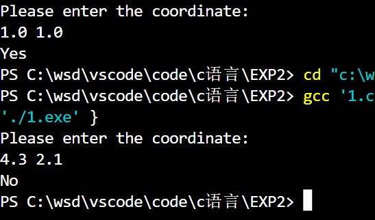
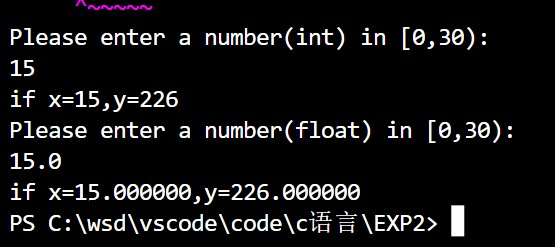
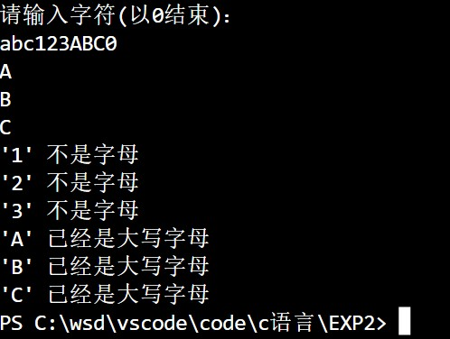
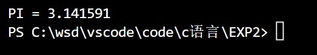

# <center>程序设计上机实验【2】</center>

**<center>《数据类型，数据结构》</center>**

**<center>王世炟 PB20151796</center>**
**<center>2022/10/09</center>**

## 1、编写程序判断一个点是否位于一个正方形内

> 有一个正方形四个顶点的坐标(x,y)分别是(2,-2),(2,2),(-2,-2),(-2,2)，x是横轴，y是纵轴。编写程序程序，判断一个给定的点坐标是否在这个正方形内（包括正方形边界）。要求程序运行时：\
(1)输入一行，包括两个实数x、y，以一个空格分开，表示坐标(x,y)。\
(2)输出一行，如果点(x,y)在正方形内，则输出“Yes”，否则输出“No”。\

**程序运行示例：**
```
输入：1 1.5 
输出：Yes
```

### A.源程序：

```
# include<stdio.h>

int main()
{
    float x, y;
    printf("Please enter the coordinate:\n");
    scanf("%f %f", &x, &y);
    if (x <= 2 && x >= -2 && y <= 2 && y >= -2)
    {
        printf("Yes");
    }
    else
    {
        printf("No");
    }
    return 0;
}
```

### B.运行结果截图：



### C.实验记录：（实验过程中出现的错误及其修改调试记录，可截图。）

## 2、编程求下列分段函数y的值

$$
y=f(x)=\begin{cases}
    x & 0\leq x <10\\
    x^2+1 & 10\leq x <20\\
    x^3+x^2+1 & 20\leq x <30
\end{cases}
$$

>编程要求：\
（1）x的数据类型分别用int和float，且其值需由键盘输入\
（2）需要判断x输入的范围是否满足要求，并给出相关提示信息\
（3）x的数据类型为int时，使用switch语句实现程序的主结构\
（4）x的数据类型为float时，用if语句实现程序的主结构

**程序运行示例：**
```
输入：输入一个整数:12
输出：x=12时，y=145
输入：输入一个实数:12.1
输出：x=12.100000时，y=147.410004（注意精度上的表示误差）
```

### A.源程序：

```
# include<stdio.h>


float calculateFloat(float x)
{
    if(x >= 0 && x < 10)
    {
        return x;
    }
    else if (x >= 10 && x < 20)
    {
        return x * x + 1;
    }
    else if (x >= 20 && x < 30)
    {
        return x * x * x + x * x + 1;
    }
}


int calculateInt(int x)
{
    int flag;
    if(x >= 0 && x < 10)
    {
        flag = 1;
    }
    else if (x >= 10 && x < 20)
    {
        flag = 2;
    }
    else if (x >= 20 && x < 30)
    {
        flag = 3;
    }
    switch (flag)
    {
    case 1:
        return x;
        break;
    
    case 2:
        return x * x + 1;
        break;

    case 3:
        return x * x * x + x * x + 1;
        break;

    default:
        break;
    }
}


int main()
{
    int x1, result1;
    float x2, result2;
    printf("Please enter a number(int) in [0,30):\n");
    scanf("%d", &x1);
    if (x1<0 || x1>=30)
    {
        printf("ERROR!The number is out of range");
        return 0;
    }
    result1 = calculateInt(x1);
    printf("if x=%d,y=%d\n", x1, result1);
    printf("Please enter a number(float) in [0,30):\n");
    scanf("%f", &x2);
    if (x2<0 || x2>=30)
    {
        printf("ERROR!The number is out of range");
        return 0;
    }
    result2 = calculateFloat(x2);
    printf("if x=%f,y=%f", x2, result2);
    return 0;
}
```

### B.运行结果截图：



### C.实验记录：（实验过程中出现的错误及其修改调试记录，可截图。）

## 3、输入字符的识别问题

>利用getchar()函数从键盘循环输入字符，如遇到小写字母则将其转换成大写字母输出，如遇到大写字母则输出“已经是大写字母”，对其它输入的字符则显示“不是字母”，如遇到字符‘0’则退出程序。

**程序运行示例：**

```
输入：
abc123ABC0
输出：
A
B
C
'1'不是字母
'2'不是字母
'3'不是字母
'A'已经是大写字母
'B'已经是大写字母
'C'已经是大写字母
```

### A.源程序：

```
# include<stdio.h>

int main()
{
    char a;
    printf("请输入字符(以0结束)：\n");
    while (1)
    {
        a = getchar();
        if (a == '0')
        {
            break;
        }
        if (a>=65 && a<=90)
        {
            printf("'%c' 已经是大写字母\n", a);
        }
        else if (a>=97 && a<=122)
        {
            printf("%c\n", a-32);
        }
        else
        {
            printf("'%c' 不是字母\n", a);
        }
    }
    return 0;
}
```

### B.运行结果截图：



### C.实验记录：（实验过程中出现的错误及其修改调试记录，可截图。）


## 4、求$\pi$的近似值。数据类型使用double。

>已知迭代公式\
$$
\frac\pi 4=1-\frac13+\frac15-\frac17\cdots+\frac{(-1)^{n-1}}{2n-1}
$$
编写程序求解π的近似值。 迭代终止条件为通项的绝对值小于等于1e-6。

### A.源程序：

```
# include<stdio.h>
# include<math.h>

int main()
{
    int n = 1;
    double temp, result;
    temp = 1;
    while (fabs(temp) > 1e-6)
    {
        n++;
        result += temp;
        temp = pow(-1, n - 1) / (2 * n - 1);
    }
    printf("PI = %lf", 4 * result);
    return 0;
}
```

### B.运行结果截图：



### C.实验记录：（实验过程中出现的错误及其修改调试记录，可截图。）