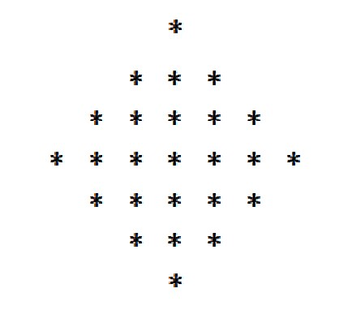
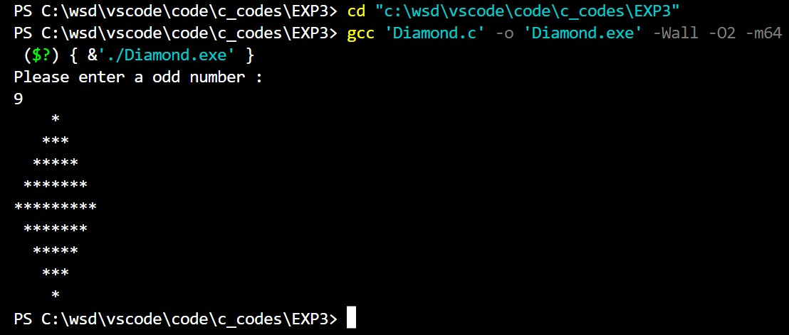
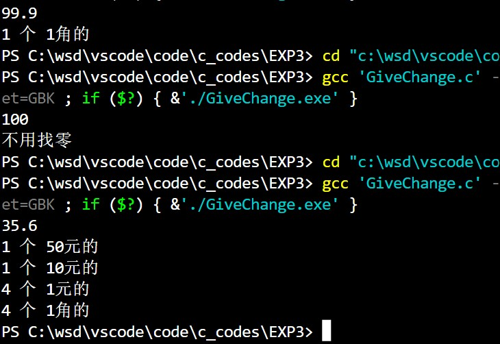
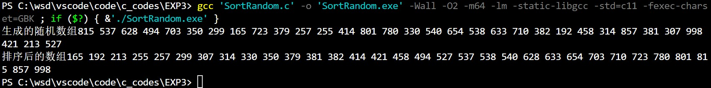

# <center>程序设计上机实验【3】</center>

**<center>《选择，循环，数组》</center>**

**<center>王世炟 PB20151796</center>**
**<center>2022/10/20</center>**

<hr>

## 1、打印菱形图案

>输入一个正整数 n （n 为奇数），打印一个 n 行的星号菱形图案。例如输入 7，输出图案如下：


### A. 源程序：

```
#include <stdio.h>

int main()
{
    int n;
    printf("Please enter a odd number :\n");
    scanf("%d", &n);
    if (n % 2 == 0)
    {
        printf("ERROR! The number is an even number.");
        return 0;
    }
    for (int i = 0; i < n / 2 + 1; i++)
    {
        for (int j = 0;j < n / 2 - i; j++)
        {
            printf(" ");
        }
        for (int j = 0; j < 2 * i + 1; j++)
        {
            printf("*");
        }
        printf("\n");
    }
    for (int i = n / 2 - 1; i >= 0; i--)
    {
        for (int j = 0;j < n / 2 - i; j++)
        {
            printf(" ");
        }
        for (int j = 0; j < 2 * i + 1; j++)
        {
            printf("*");
        }
        printf("\n");
    }
    return 0;
}
```

### B. 运行结果截图：



### C. 实验记录：（实验过程中出现的错误及其修改调试记录，可截图。）


## 2、找零问题

>编程要求：\
人民币面额有 $100$ 元、$50$ 元、$20$ 元、$10$ 元、$5$ 元 $1$ 元、$5$ 角、$1$ 角、五分、贰分、壹分等 $11$ 种，现拿 $100$ 元去购买物品，一共花了 $x$ 元，（ $0.00 ≤ x ≤100.00$）\
请设计程序给出找零的方案，使之每次找零的张数最少。\
编程要求：\
（1）输入购买物品的费用 x，并判断其合理性\
（2）对输入合理的费用，给出找零的方案（即每种钱币的数量），使之找零的钱币张数（个数）最少\
（3）精确到分币

**程序运行示例：**

```
01 输入：100.00
02 输出：不用找零
03
04 输入：64.21
05 输出： 找零总共 35.79 元：
06 1 个 20 元的
07 1 个 10 元的
08 1 个 5 元的
09 1 个 5 角的
10 2 个 1 角的
11 1 个 5 分的
12 2 个 2 分的
```

### A. 源程序：

```
#include <stdio.h>
#include <math.h>

int main()
{
    double x, change;
    double m[11] = {100, 50, 20, 10, 5, 1, 0.5, 0.1, 0.05, 0.02, 0.01};
    int num[11] = {0, 0, 0, 0, 0, 0, 0, 0, 0, 0, 0}; // 用于存储钱的张数
    char ch0[] = "100元";
    char ch1[] = "50元";
    char ch2[] = "20元";
    char ch3[] = "10元";
    char ch4[] = "5元";
    char ch5[] = "1元";
    char ch6[] = "5角";
    char ch7[] = "1角";
    char ch8[] = "5分";
    char ch9[] = "2分";
    char ch10[] = "1分";
    char *arr[] = {ch0, ch1, ch2, ch3, ch4, ch5, ch6, ch7, ch8, ch9, ch10};
    scanf("%lf", &x);
    if (x < 0)
    {
        printf("ERROR!OUT OF RANGE!");
        return 0;
    }
    if (x > 100)
    {
        printf("买不起。");
        return 0;
    }
    if (x == 100)
    {
        printf("不用找零");
        return 0;
    }
    
    change = 100 - x + 0.0000001;
    //printf("%lf", change - 0.05 - 0.02 - 0.02 - 0.01 + 0.0000001);
    
    for (int i = 0; i < 11; i++)
    {
        while (change >= m[i])
        {
            num[i]++;
            change -= m[i];
        }
    }
    for (int i = 0; i < 11; i++)
    {
        if (num[i] != 0)
        {
            printf("%d 个 %s的\n", num[i], arr[i]);
        }
    }
    
    return 0;
}
```

### B. 运行结果截图：



### C. 实验记录：（实验过程中出现的错误及其修改调试记录，可截图。）

使之找零的钱币张数（个数）最少，就是大面值的钱尽量多。实验中出现了精度问题，即输入 $99.9$ 时不会输出 1个1角的，而是会输出 1个5分的， 2个2分的。\
出现这个结果的原因就是因为精度不够于是我做了以下测试：
```
printf("%lf", change - 0.05 - 0.02 - 0.02 - 0.01);
```
发现输出结果是 `-0.000000`,于是我就加了一个`0.0000001`把上式变成正的，就解决了问题。


## 3、随机数的排序

>定义数组 `int randnum[32]`; 随机产生 $32$ 个位于[100,1000]之间的整数，存放于数组中。然后将它们从小到大排序并输出。\
怎样获得随机数：
>- 随机数的产生使用`rand()`头文件中的`rand()`和`rand()`函数。`rand()`函数执行一次会在 0~32767 范围中产生一个随机数，`rand()`函数给`rand()`函数设置随机数种子（可以理解为初值）;当随机数的种子不同，`rand()`函数产生的随机数序列就不同。 设置一个随机数种子后，多次执行`rand()`函数，如在循环中 `randnum[i]=rand()`； 可以获得一组随机数。如果随机数的种子相同则后续使用`rand()`函数产生的随机序列也相同。
>- 为了使用程序每次运行时产生的随机数都不一样，可以用`time.h`头文件中的`time(NULL)`函数作为`srand()`函数的参数来设置随机数的种子。
如： `srand(time(NULL));`
>- 通过算术运算等将`rand()`函数产生的随机数大小调整到 $[100,1000]$范围内

### A. 源程序：

```
#include <stdio.h>
#include <stdlib.h>
#include <time.h>

void Swap(int *a, int *b) //交换两个数
{
    int temp = *a;
    *a = *b;
    *b = temp;
    return;
}

int Partition(int a[], int p, int r) //快速排序的partition步骤
{
    int x, i;

    x = a[r];
    i = p - 1;
    for (int j = p; j < r; j++)
    {
        if (a[j] <= x)
        {
            i += 1;
            Swap(&a[i], &a[j]);
        }
    }
    Swap(&a[i + 1], &a[r]);
    return i + 1;
}

void QuickSort(int a[], int p, int r) //快速排序
{
    int q;
    if (p < r)
    {
        q = Partition(a, p, r); //用q分割为两个子问题
        QuickSort(a, p, q - 1);
        QuickSort(a, q + 1, r);
    }
    return;
}

int main()
{
    int rand_num[32];
    srand((unsigned)time(NULL));
    for (int i = 0; i < 32; i++)
    {
        rand_num[i] = rand() % (1000 - 100 + 1) + 100;
    }
    QuickSort(rand_num, 0, 31);
    for (int i = 0; i < 32; i++)
    {
        printf("%d\n", rand_num[i]);
    }
    return 0;
}
```

### B. 运行结果截图：



### C. 实验记录：（实验过程中出现的错误及其修改调试记录，可截图。）
