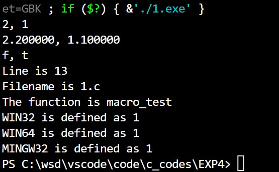
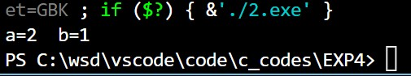
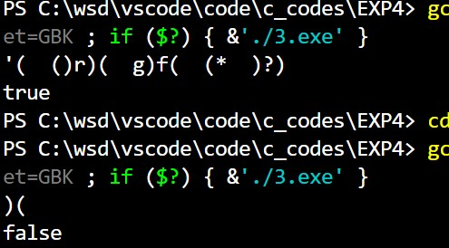

@import "D:\USR\vue.css"

# <center>Homework8</center>


**<center>王世炟 PB20151796**</center>
**<center>2022/11/10</center>**

<center>编译预处理 指针</center>

## 1. 编译预处理

>(1)设计一个带参数的宏 `swap(A, B, TYPE)` ，功能是交换两个变量 A,B 的值，TYPE 对应变量的类型。\
在 `main()` 函数中分别输入两个 `int` 变量、两个 `float` 变量、两个 `char` 变量，使用宏 `swap` 将它们的值互
换 并输出结果。\
(2) 写一个函数 `void macro_test(void):`
>- (2.1) 输出下面三个宏的值： （这三个宏常用于输出调试信息，帮助定位程序 bug 的位置）
用`%d` 输出 `__LINE__` ，代表当前行号。
用`%s` 输出 `__FILE__` 和 `__func__` ，分别代表当前文件名和函数名。
>- (2.2) 用 `#ifdef` 或者 `#ifndef` 判断下列宏在你的系统中是否已有定义（可能因系统而异），若有定义则
printf 输出提示信息。\
`_WIN32`\
`_WIN64`\
`__CYGWIN__`\
`__MINGW32__`

**源码**

```c
#include <stdio.h>

#define swap(A, B, TYPE) \
    {                    \
        TYPE temp;       \
        temp = A;        \
        A = B;           \
        B = temp;        \
    }

void macro_test(void)
{
    printf("Line is %d\n", __LINE__);
    printf("Filename is %s \nThe function is %s\n", __FILE__, __func__);
    #ifdef _WIN32
    printf("WIN32 is defined as %d\n", _WIN32);
    #endif
    #ifdef _WIN64
    printf("WIN64 is defined as %d\n", _WIN64);
    #endif
    #ifdef __CYGWIN__
    printf("CYGWIN is defined as %d\n", __CYGWIN__);
    #endif
    #ifdef __MINGW32__
    printf("MINGW32 is defined as %d\n", __MINGW32__);
    #endif
}

int main()
{
    int a = 1, b = 2;
    float x = 1.1, y = 2.2;
    char m = 't', n = 'f';
    swap(a, b, int);
    swap(x, y, float);
    swap(m, n, char);
    printf("%d, %d\n", a, b);
    printf("%f, %f\n", x, y);
    printf("%c, %c\n", m, n);
    macro_test();
    return 0;
}
```

**运行结果**

在代码中有相应赋值



**实验报告**

c语言宏的有关知识


## 2 swap 函数-指针版：

>写一个函数 `void swap( int *a, int *b );` 用来交换两个变量的值。在 `main()`函数中输入两个整型变量的
值, 调用 `swap` 完成两个变量值的交换，并输出结果。


**源码**

```c
#include <stdio.h>

void swap( int *a, int *b )
{
    int temp = *a;
    *a = *b;
    *b = temp;
    return;
}

int main()
{
    int a = 1, b = 2;
    swap(&a, &b);
    printf("a=%d  b=%d", a, b);
}
```

**运行结果**




**实验报告**

注意传地址即可。

## 3. 合法括号序列-指针版
>说明：
>1) 改写作业 7 中的合法括号序列一题。 编写一个自定义函数，`int valid_brackets(char *str);` 判
断字符串中出现的小括号（包括左括号‘(’和右括号’)’ ）序列是否合法的格式。 若合法返回 1，否则返回 0. 要求：函数用指针实现，不能出现[ ]算符。
>2) 在 main 函数中输入含有小括号的字符串，假定串长不超过 100 个字符。调用上述自定义函数判断输
入串中的括号格式，若格式正确则在 main 函数中输出 true,否则输出 false.

```c
输入样例：a((b)(c))
输出样例：true
输入样例：)a()()(
输出样例：false
输入样例：(x)((y)(z)
输出样例：false
```


**源码**

```c
#include <stdio.h>

int GoodBrackets(char *str)
{
    int i = 0, count = 0;
    while (*(str + i) != '\0')
    {
        if (*(str + i) == '(')
        {
            count++;
        }
        else if (*(str + i) == ')')
        {
            count--;
        }
        if (count < 0)
        {
            return 0;
        }
        i++;
    }
    if (count == 0)
    {
        return 1;
    }
    return 0;
}

int main()
{
    int flag;
    char str[50];
    gets(str);
    flag = GoodBrackets(str);
    if (flag)
    {
        printf("true");
    }
    else
    {
        printf("false");
    }
    return 0;
}
```

**运行结果**




**实验报告**

将 `str[i]` 替换为 `*(str+i)` 即可。