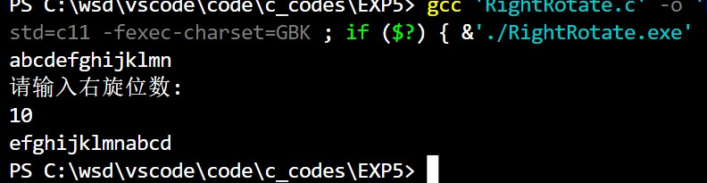
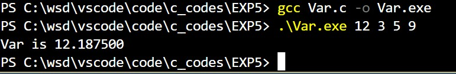
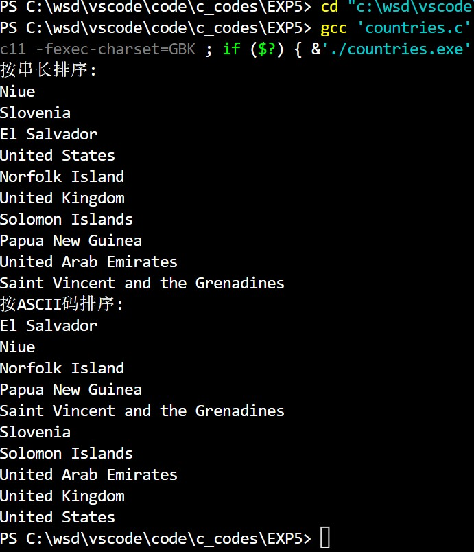

@import "D:\USR\vue.css"

# <center>程序设计上机实验</center>

**<center>《指针及其应用》</center>**

**<center>王世炟 PB20151796</center>**
**<center>2022/11/16</center>**

<hr>


## 1、 
>将一个字符串循环右移 n 位。要求用指针实现。

**实验要点：** 字符串，指针

说明：
1) 输入字符串长度限 50 字符以内，若超出 50 则只取前 50 个；
2) n 是用户输入的一个正整数；
3) 循环右移一位是指将最后一个字符移到字符串最左面，其余字符均向右移动一个位
置。循环右移 n 位是将上述循环右移一位的动作重复 n 次。(编程序考虑怎样减少
循环次数从而提高程序效率？是否可以不用循环嵌套？)
4) 编写函数完成循环右移功能，在主函数中输入字符串和整数 n，调用循环右移函数，
输出右移之后的字符串。

```c
输入样例：
abcdefghijklmn
10
输出样例：
efghijklmnabcd
```

**源程序：**

```c
#include <stdio.h>
#include <string.h>

void RightRotate0(char *a, int n, int m) //右旋m位
{
    char temp;

    int i, j;
    for (i = 0; i < m; i++)
    {
        temp = *(a + n - 1);
        for (j = n - 1; j > 0; j--)
        {
            *(a + j) = *(a + j - 1);
        }
        *a = temp;
    }
    return;
}

void RightRotate1(char *a, int n, int m)
{
    char str[50];
    for (int i = 0; i < n; i++)
    {
        *(str + (i + m) % strlen(a)) = *(a + i);
    }
    for (int i = 0; i < n; i++)
    {
        *(a + i) = *(str + i);
    }
    return;
}

int main()
{
    int i, n;
    char str0[500], str[51];
    str[50] = '\0';
    gets(str0);
    for (i = 0; i < 50 && str0[i] != '\0'; i++)
    {
        str[i] = str0[i];
    }
    printf("请输入右旋位数:\n");
    scanf("%d", &n);
    n = n % strlen(str);
    RightRotate1(str, strlen(str), n);
    printf("%s\n", str);
    return 0;
}
```
**运行结果截图：**



**实验记录：（实验过程中出现的错误及其修改调试记录，可截图。）**

如果右旋位数大于串长度，则将位数对串长度取模，即可简化次数。

## 2、
>编写带命令行参数的程序，求若干个实数的方差。

**实验要点：命令行参数，指针**

说明：
1) 用命令行形式执行程序并通过命令行参数输入若干实数，把这些实数的字符串形式
转换为 double 类型的数据，并根据参数个数将这些数据存储于动态分配的内存中。
2) 计算这些数据的方差并输出。
3) 提示：可使用库函数 `pow`，`atof`。原型如下：
```c
#include <math.h>
double pow(double x, double y); //幂函数，返回 xy
#include <string.h>
double atof(const char *str); //将字符串 str 转化为浮点数并返回
```
```c
输入样例：(假定可执行程序的名称是 fangcha.exe )
fangcha.exe 12 3 5 9
输出样例：
12.187500
```

**源程序：**

```c
#include <stdio.h>
#include <stdlib.h>
#include <string.h>

double Average(double a[], int n) //计算数组的平均值
{
    double sum = 0;
    double average;
    for (int i = 0; i < n; i++)
    {
        sum += a[i];
    }
    average = sum / n;
    return average;
}

double Var(double a[], int n) //计算数组的方差
{
    double sum = 0;
    double average, var;
    average = Average(a, n);
    for (int i = 0; i < n; i++)
    {
        sum += (a[i] - average) * (a[i] - average);
    }
    var = sum / n;
    return var;
}

int main(int argc, char *argv[])
{
    double var;
    double *a = (double *)malloc((argc - 1) * sizeof(double));
    for (int i = 0; i < argc - 1; i++)
    {
        a[i] = atof(argv[i + 1]);
    }
    var = Var(a, argc - 1);
    printf("Var is %lf", var);
    return 0;
}
```
**运行结果截图：**




**实验记录：（实验过程中出现的错误及其修改调试记录，可截图。）**

`main` 函数原型为 `int main(int argc, char *argv[])` 其中 `argc` 代表命令行输入的字符串个数+1， `argv` 是个字符串数组，用于储存命令行输入的字符串。

## 3、
>随用指针数组排序并输出国家名称

**实验要点：字符串，指针数组**

说明：
1) 设 `char countries[10][40]`, 输入并存储十个国家的名称。
2) 保持 `counties` 数组内容不变，针对该数组制作两张索引表，索引表用指针数组实现。其中每个指针指向一个字符串（国家名称），要求将一张索引表按照串长（从小到大）排序，另一张索引表根据 ASCII 码顺序排序。利用两张索引表输出两种排好序的国家名称。

```c
输入样例：
Saint Vincent and the Grenadines
El Salvador
Papua New Guinea
Niue
Norfolk Island
United Arab Emirates
United Kingdom
United States
Slovenia
Solomon Islands
输出样例： 略
```

**源程序：**

```c
#include <stdio.h>
#include <string.h>

void InsertSort1(char *order[], int n)
{
    char *temp;
    int i, j;
    for (i = 0; i < n; i++)
    {
        temp = order[i];
        for (j = i - 1; j >= 0 && (int)strlen(order[j]) > (int)strlen(temp); j--)
        {
            order[j + 1] = order[j];
        }
        order[j + 1] = temp;
    }
    return;
}

void InsertSort2(char *order[], int n)
{
    char *temp;
    int i, j;
    for (i = 0; i < n; i++)
    {
        temp = order[i];
        for (j = i - 1; j >= 0 && (strcmp(order[j], temp) == 1); j--)
        {
            order[j + 1] = order[j];
        }
        order[j + 1] = temp;
    }
    return;
}

int main()
{
    char countries[10][40] = {"Saint Vincent and the Grenadines",
                              "El Salvador",
                              "Papua New Guinea",
                              "Niue",
                              "Norfolk Island",
                              "United Arab Emirates",
                              "United Kingdom",
                              "United States",
                              "Slovenia",
                              "Solomon Islands"};
    char *order1[10], *order2[10];
    for (int i = 0; i < 10; i++)
    {
        order1[i] = countries[i];
        order2[i] = countries[i];
    }
    InsertSort1(order1, 10);
    InsertSort2(order2, 10);
    printf("按串长排序:\n");
    for (int i = 0; i < 10; i++)
    {
        printf("%s\n", order1[i]);
    }
    printf("按ASCII码排序:\n");
    for (int i = 0; i < 10; i++)
    {
        printf("%s\n", order2[i]);
    }
    return 0;
}
```
**运行结果截图：**



**实验记录：（实验过程中出现的错误及其修改调试记录，可截图。）**

`strlen()` 函数用于获得字符串的长度， `strcmp()` 函数用于比较两个字符串的ASCII码大小，第一个字符串大于第二个字符串返回1，相等返回0，小于返回-1.