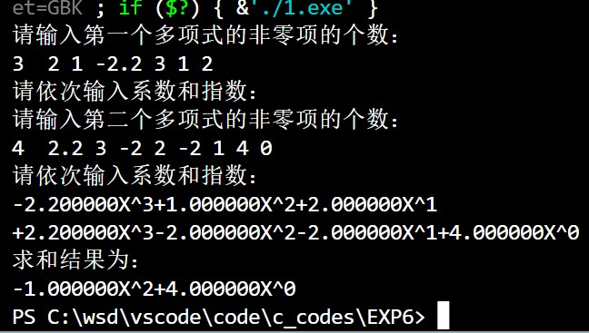
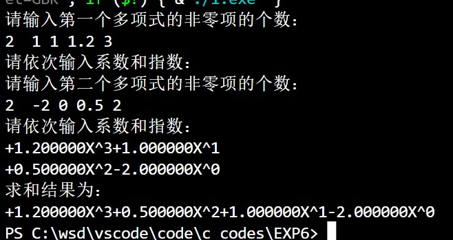
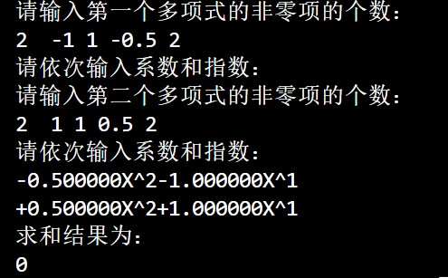
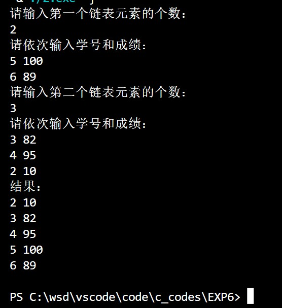
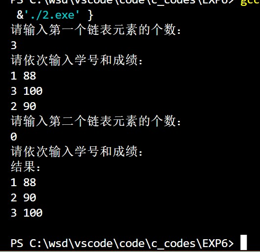
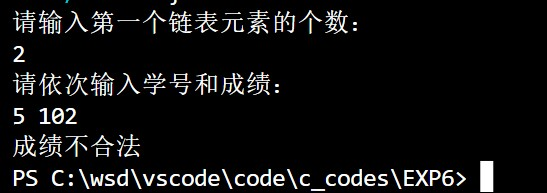
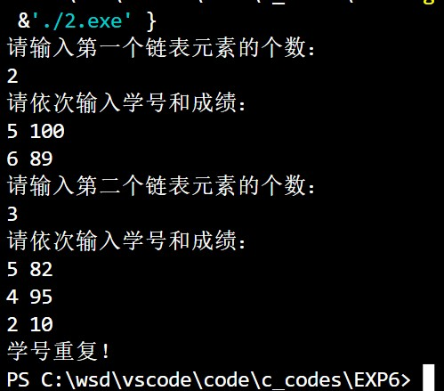

# <center>程序设计上机实验</center>

**<center>《结构体、链表》</center>**

**<center>王世炟 PB20151796</center>**
**<center>2022/11/24</center>**

<hr>


## 1、

>求两个多项式的和。【实验要点：链表】\
说明：
>1) 一个多项式可以表示为二元组序列 {(a1,e1), (a2,e2), ... (an,en)}, 其中 ai
表示第 i 项的系数， ei 表示第 i 项的指数。
>2) 编写函数实现一个多项式的输入，返回多项式链表的头指针。
>3) 编写函数求两个多项式相加的结果，返回结果多项式链表的头指针。
>4) 编写函数输出一个多项式 。
>5) 在 main 函数中分别调用上述函数，实现输入两个多项式，求出它们的和，并
输出结果。
>6) 输入数据分 2 行，每行分别先给出多项式非零项的个数ｎ，再输入ｎ对系数
和指数。数字间仅以空格分隔。

链表结点数据结构可定义为：
```c
struct PolyNode{
float a; //系数
int e; //指数
PolyNode * next; //指向下一个结点
};
```
```c
输入样例:
4 3 4 -5 2 6 1 -2 0
3 5 20 -7 4 3 1
输出样例:
5 X^20 -4 X^4 -5 X^ 2 + 9 X^1 -2 X^0
```

**源程序：**

```c
#include <stdio.h>
#include <stdlib.h>

#define swap(A, B, TYPE) \
    {                    \
        TYPE temp;       \
        temp = A;        \
        A = B;           \
        B = temp;        \
    }

typedef struct PolyNode
{
    float a;               //系数
    int e;                 //指数
    struct PolyNode *next; //指向下一个结点
} PNode, *PtrPNode;

void BubbleSort(float *a, int *e, int n) //冒泡排序
{
    for (int i = n - 1; i > 0; --i)
    {
        for (int j = 0; j < i; j++)
        {
            if (e[j] < e[j + 1])
            {
                swap(e[j], e[j + 1], int);
                swap(a[j], a[j + 1], float);
            }
        }
    }
    return;
}

PtrPNode Init(int n) // 尾插法
{
    PtrPNode head, p1, p2;
    float *a;
    int *e;
    a = (float *)malloc(n * sizeof(float));
    e = (int *)malloc(n * sizeof(int));
    for (int i = 0; i < n; i++)
    {
        scanf("%f %d", &a[i], &e[i]);
    }
    BubbleSort(a, e, n);
    head = (PtrPNode)malloc(sizeof(PNode));
    head->next = NULL;
    p1 = head;
    for (int i = 0; i < n; i++)
    {
        p2 = (PtrPNode)malloc(sizeof(PNode));
        p2->next = NULL;
        p2->a = a[i];
        p2->e = e[i];
        // scanf("%f %d", &p2->a, &p2->e);
        p1->next = p2;
        p1 = p2;
    }
    return head;
}

void Print(PtrPNode head)
{
    PtrPNode temp = head->next, last = head;
    int flag = 0;
    while (temp) // temp 为 NULL 即到达链表末尾
    {
        if (temp->a > 0)
        {
            printf("+%fX^%d", temp->a, temp->e);
            flag = 1;
        }
        else if (temp->a == 0)
        {
            last->next = temp->next;
            free(temp);
            temp = last->next;
            continue;
        }
        else
        {
            printf("%fX^%d", temp->a, temp->e);
            flag = 1;
        }
        temp = temp->next;
        last = last->next;
    }
    if (!flag)
    {
        printf("%d", 0);
    }

    printf("\n");
    return;
}

PtrPNode Sum(PtrPNode head1, PtrPNode head2)
{
    PtrPNode temp1 = head1->next, temp2 = head2->next; // 用于遍历两个链表
    PtrPNode L, head, temp;                            // 用于存储求和后的结果
    head = (PtrPNode)malloc(sizeof(PNode));
    head->next = NULL;
    L = head;
    while (temp1 && temp2) // 两个链表均未结束
    {
        if (temp1->e > temp2->e)
        {
            temp = (PtrPNode)malloc(sizeof(PNode));
            temp->next = NULL;
            temp->a = temp1->a;
            temp->e = temp1->e;
            L->next = temp;
            L = temp;
            temp1 = temp1->next;
        }
        else if (temp1->e < temp2->e)
        {
            temp = (PtrPNode)malloc(sizeof(PNode));
            temp->next = NULL;
            temp->a = temp2->a;
            temp->e = temp2->e;
            L->next = temp;
            L = temp;
            temp2 = temp2->next;
        }
        else // 两项指数相等，那么系数相加
        {
            temp = (PtrPNode)malloc(sizeof(PNode));
            temp->next = NULL;
            temp->a = temp1->a + temp2->a;
            temp->e = temp1->e;
            L->next = temp;
            L = temp;
            temp1 = temp1->next;
            temp2 = temp2->next;
        }
    }
    if (temp1) // 链表1未结束，将剩余部分复制到L后
    {
        L->next = temp1;
    }
    if (temp2) // 链表2未结束，将剩余部分复制到L后
    {
        L->next = temp2;
    }
    return head;
}

int main()
{
    int n;
    PtrPNode head1, head2, head;
    printf("请输入第一个多项式的非零项的个数：\n");
    scanf("%d", &n);
    if (n <= 0)
    {
        printf("非零项的个数需要为正数！");
        return 0;
    }
    printf("请依次输入系数和指数：\n");
    head1 = Init(n);
    printf("请输入第二个多项式的非零项的个数：\n");
    scanf("%d", &n);
    if (n <= 0)
    {
        printf("非零项的个数需要为正数！");
        return 0;
    }
    printf("请依次输入系数和指数：\n");
    head2 = Init(n);
    Print(head1);
    Print(head2);
    head = Sum(head1, head2);
    printf("求和结果为：\n");
    Print(head);
    return 0;
}
```

**运行结果截图：**

<center>
	
	&emsp;&emsp;
	
    &emsp;&emsp;
	
	<br/>
</center>
<br/>


**实验记录：（实验过程中出现的错误及其修改调试记录，可截图。）**


## 2、 
>构造两个链表 lista 和 listb，链表中的结点成员包括学号、成绩。输入
数据的格式为，第一行是 lista 链表的元素数量 N,接下来 N 行是 lista 的结
点数据，每一行数据由学号和成绩两部分组成；接下来一行是 listb 链表的元
素数量 M,接下来 M 行是 listb 的结点数据。\
输入完成后，合并两个链表，要求合并后链表结点按学号升序排列。并输出排列
之后的链表内容。

```c
输入样例：
2
5 100
6 89
3
3 82
4 95
2 10
输出样例：
2 10
3 82
4 95
5 100
6 89
```
**源程序：**

```c
#include <stdio.h>
#include <stdlib.h>

typedef struct node
{
    int PID;
    int score;
    struct node *next;
} Node, *PNode;

PNode Init(int n) // 尾插法
{
    PNode head, p1, p2;
    head = (PNode)malloc(sizeof(Node));
    head->next = NULL;
    p1 = head;
    for (int i = 0; i < n; i++)
    {
        p2 = (PNode)malloc(sizeof(Node));
        p2->next = NULL;
        scanf("%d %d", &p2->PID, &p2->score);
        if (p2->score <0 || p2->score > 100)
        {
            printf("成绩不合法\n");
            return NULL;
        }
        p1->next = p2;
        p1 = p2;
    }
    return head;
}

void Print(PNode head)
{
    PNode temp = head->next;
    while (temp)
    {
        printf("%d %d\n", temp->PID, temp->score);
        temp = temp->next;
    }
    printf("\n");
    return;
}

void Swap(int *a, int *b)
{
    int temp = *a;
    *a = *b;
    *b = temp;
    return;
}

PNode Sort(PNode head) // 冒泡排序
{
    int count = 0;
    PNode temp = head->next;
    PNode last = head; // 指向上一个结点
    while (temp)
    {
        temp = temp->next;
        count++;
    }
    for (int i = count - 1; i > 0; --i)
    {
        last = head;
        temp = head->next;
        for (int j = 0; j < i; j++, last = last->next)
        {
            if (temp->PID > temp->next->PID)
            {
                last->next = temp->next;
                temp->next = temp->next->next;
                last->next->next = temp;
            }
            else
            {
                temp = temp->next; // 若未发生交换，则正常继续遍历
            }
        }
    }

    // for (int i = count - 1; i > 0; --i)
    // {
    //     temp = head->next;
    //     for (int j = 0; j < i; j++, temp = temp->next)
    //     {
    //         if (temp->PID > temp->next->PID)
    //         {
    //             Swap(&temp->PID, &temp->next->PID);
    //             Swap(&temp->score, &temp->next->score);
    //         }
    //     }
    // }
    return head;
}

int correct(PNode head1, PNode head2, int m, int n)
{
    PNode temp1 = head1->next, temp2 = head2->next;
    for (int i = 0; i < m; i++)
    {
        for (int j = 0; j < n; j++)
        {
            if (temp1->PID == temp2->PID)
            {
                return 0;
            }
            temp2 = temp2->next;
        }
        temp1 = temp1->next;
        temp2 = head2->next;
    }
    return 1;
}

PNode Merge(PNode head1, PNode head2, int m, int n)
{
    int flag;
    flag = correct(head1, head2, m, n);
    if (!flag)
    {
        printf("学号重复！\n");
        return NULL;
    }
    PNode temp = head1->next;
    while (temp->next) // 找到链表结尾
    {
        temp = temp->next;
    }
    temp->next = head2->next;
    head1 = Sort(head1);
    return head1;
}

int main()
{
    int m, n;
    PNode head1, head2, head;
    printf("请输入第一个链表元素的个数：\n");
    scanf("%d", &m);
    printf("请依次输入学号和成绩：\n");
    head1 = Init(m);
    if (!head1)
    {
        return 0;
    }
    printf("请输入第二个链表元素的个数：\n");
    scanf("%d", &n);
    printf("请依次输入学号和成绩：\n");
    head2 = Init(n);
    if (!head2)
    {
        return 0;
    }
    // Print(head1);
    // Print(head2);
    head = Merge(head1, head2, m, n);
    if (!head)
    {
        return 0;
    }
    printf("结果：\n");
    Print(head);
    return 0;
}
```

**运行结果截图：**

<center>
	
	&emsp;&emsp;
	
	<br/>
</center>
<br/>

<center>
	
	&emsp;&emsp;
	
	<br/>
</center>
<br/>

**实验记录：（实验过程中出现的错误及其修改调试记录，可截图。）**

链表建立、插入、删除、排序，以及边界情况的判断。