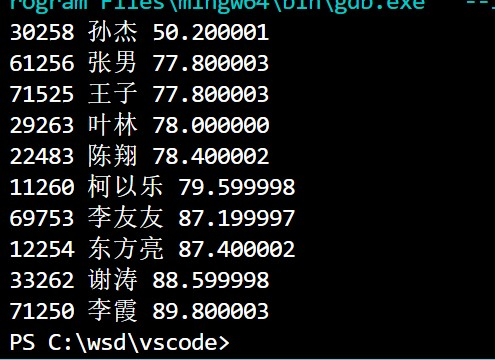
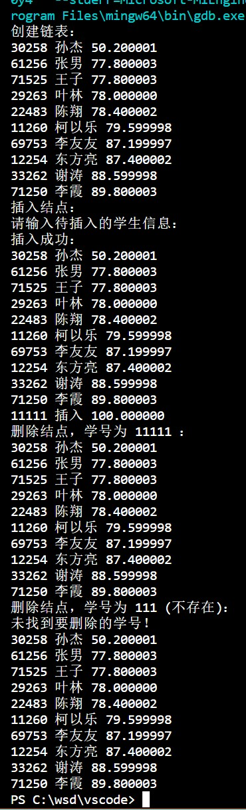

"D:\USR\vue.css"

# <center>Homework10</center>


**<center>王世炟 PB20151796**</center>
**<center>2022/11/23</center>**

<center>结构体和链表</center>

<hr>

## 1 、
>用结构体数组实现学生成绩表。\
说明：

```c
结构体类型定义为：
struct student{
int stunum; //学号
char name[20]; //姓名
float examscore; //考试成绩
float labscore; //实验成绩
float totalmark; //总评成绩
};
```
1) 在主函数中定义结构体数组，`struct student stutable[10];`
输入如下十个学生的成绩数据，每个学生信息包括 学号 、姓名 、考试成绩 ，实验成绩。同时计算每个学生的总评成绩（ $=考试成绩*60\% + 实验成绩*40\%$）并保存至每个结
构体的 totalmark。

```c
输入格式如下：
71250 李霞 95 82
69753 李友友 88 86
12254 东方亮 87 88
61256 张男 73 85
30258 孙杰 25 88
11260 柯以乐 82 76
33262 谢涛 91 85
29263 叶林 80 75
22483 陈翔 80 76
71525 王子 71 88
```

[注] 数据输入的方式可以采用输入文件重定向

2) 在主函数中定义一个结构体指针数组，`struct student *parray[10] ;` 使其每一个指针指向上述结构体数组中的一个元素； 按总评成绩从高到低的顺序，对指针数组 parray进行排序，数组 stutable 保持不变，可避免结构体数组元素之间的交换移动。按总评
成绩从高到低的顺序输出排序之后的全部学生成绩。

**源码**

```c
#include <stdio.h>

struct student
{
    int stunum;      //学号
    char name[20];   //姓名
    float examscore; //考试成绩
    float labscore;  //实验成绩
    float totalmark; //总评成绩
};

void Sort(struct student *parray[], int n) // 插入排序
{
    int i, j;
    struct student *temp;
    for (i = 0; i < n; i++)
    {
        temp = parray[i];
        for (j = i - 1; j >= 0 && parray[j]->totalmark > temp->totalmark; j--)
        {
            parray[j + 1] = parray[j];
        }
        parray[j + 1] = temp;
    }
    return;
}

int main()
{
    struct student student[10];
    struct student *parray[10];
    freopen("score.txt", "r", stdin);
    for (int i = 0; i < 10; i++)
    {
        scanf("%d %s %f %f", &student[i].stunum, student[i].name, &student[i].examscore, &student[i].labscore);
        student[i].totalmark = 0.6 * student[i].examscore + 0.4 * student[i].labscore;
        // printf("%d %s %f %f %f\n", student[i].stunum, student[i].name, 
        // student[i].examscore, student[i].labscore, student[i].totalmark);
        parray[i] = student + i;
    }
    Sort(parray, 10);
    for (int i = 0; i < 10; i++)
    {
        // printf("%d %s %f %f %f\n", parray[i]->stunum, parray[i]->name, parray[i]->examscore, 
        // parray[i]->labscore, parray[i]->totalmark);
        printf("%d %s %f\n", parray[i]->stunum, parray[i]->name, parray[i]->totalmark);
    }
    return 0;
}
```

**运行结果**



其中，`score.txt` 内容如下：

```c
71250 李霞 95 82
69753 李友友 88 86
12254 东方亮 87 88
61256 张男 73 85
30258 孙杰 25 88
11260 柯以乐 82 76
33262 谢涛 91 85
29263 叶林 80 75
22483 陈翔 80 76
71525 王子 71 88
```

**实验报告**

结构体指针的使用。


## 2、 
>用链表实现学生成绩表管理。\
接上题，对结构体类型定义增加一个指针成员。
1) 结构体类型定义修改为：
```c
struct student{
int stunum; //学号
char name[20]; //姓名
float examscore; //考试成绩
float labscore; //实验成绩
float totalmark; //总评成绩
struct student * next; //下一个结点
};
```
2) 编写函数实现建立链表：`struct student * create( int n)`, n 是学生人数。函数中输入 n
个学生的信息，同时计算总评成绩，按照总评成绩从高到低的方式形成有序链表。返回链表头指针。
3) 编写函数 `struct student * delete(struct student * head, int stunum)`, 将学号为
stunum 的结点删除；返回链表的头指针。
4) 编写函数 `struct student * insert( struct student * head)`, 插入一个新的结点到链表
中，并保持按总评成绩从高到低有序。返回链表的头指针。
5) 在主函数中分别调用上述函数，建立链表的 10 个学生数据同第一题。删除结点时的测
试数据可以是现有的学号、也可以是不存在的学号—函数应输出提示未找到并返回原
有头指针。新增结点时数据为任意与现有结点不同的值。在主函数中输出每次函数调
用后的链表内容。

**源码**

@import "2.c"

**运行结果**




由于使用重定向，故在`score.txt`末尾添加要插入的表项，内容如下：

```c
71250 李霞 95 82
69753 李友友 88 86
12254 东方亮 87 88
61256 张男 73 85
30258 孙杰 25 88
11260 柯以乐 82 76
33262 谢涛 91 85
29263 叶林 80 75
22483 陈翔 80 76
71525 王子 71 88
11111 插入 100 100
```

**实验报告**

练习插入、删除等链表操作，需要对于指针的熟练运用。