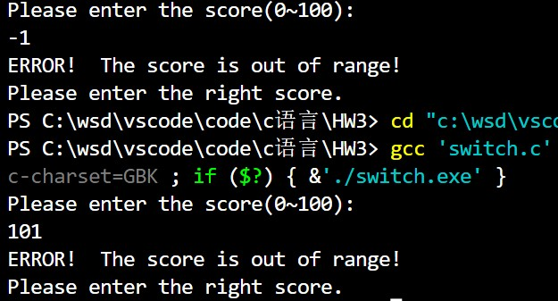

# <center>Homework3</center>


**<center>王世炟 PB20151796**</center>
**<center>2022/09/14</center>**

[TOC]
---

## 1

**下述答案均已经过程序检验，且并未出现与计算结果的差异**

>先尝试计算下列表达式的值；
再编程通过scanf函数从键盘输入数据、计算这些表达式的值后通过printf函数打印。
对比自己的计算结果与程序的输出，如存在差异请分析原因。

**对每个表达式中的变量取值均为：** int a=2, b=3, c=4;  float x=3.5, y=4.8;

### (1) 算术运算

#### (a)	3.5+1/2+56%10

**<center>9.5</center>**

$$
1/2 = 0 \\
56\%10 =6\\
3.5+6=9.5
$$


#### (b)	a++*1/3

**<center>0</center>**

$$
1/3 = 0 \\
a++代表先使用a原来的值进行运算，再加1\\
\therefore a++*1/3 = 2*0=0
$$

#### (c)	x+a%3*(int)(x+y)%2/4

**<center>3.5</center>**

$$
()优先级最高\\
\%、*、/优先级相同，应从左向右运算\\
计算顺序如下:\\
(int)(x+y) = (int)(3.5+4.8)=(int)(8.3)=8\\
a\%3 =2\\
2*8 = 16\\
16\%2 = 0\\
0/4=0\\
3.5+0=3.5
$$

#### (d)	(float)(a+b)/2+(int)x%(int)y

**<center>5.5</center>**

$$
计算顺序的解释同上题\\
(float)(a+b) = (float)(2+3)=(float)(5)=5.0(此处用一位小数表示，当然float类型不止一位)\\
(int)x=(int)(3.5)=3\\
(int)y=(int)(4.8)=4\\
5.0/2=2.5\\
3\%4 = 3\\
2.5+3 = 5.5
$$

### (2)	关系、逻辑运算

#### (a)	b>c&&b==c

**<center>0</center>**
3>4结果为假\
3==4结果为假\
$3>4 \&\& 3==4$结果为假，输出为**0**

#### (b)	!(a>b)&&!c||1

**<center>1</center>**
$!优先级高于\&\&高于||$\
所以计算顺序如下：\
$$
!(2>3)=!0=1\\
!c = !1 = 0\\
1\&\&0=0\\
0||1=1
$$

#### (c)	!(x=a)&&(y=b)&&0

**<center>0</center>**
优先级分析同上。**=是赋值，复制成功为1**\
$$
!(x=2)=!1 = 0\\
(y=3)=1\\
0\&\&1 =0\\
0\&\&0=0
$$

#### (d)	!(a+b)+c-1&&b+c/2

**<center>1</center>**
优先级:$'!'~>~'/'~>~'+'~=~'-'~>~'\&\&'$\
$$
!(a+b) = !1 =0\\
c/2 = 4/2 = 0\\
!(a+b)+c-1 = 0+4-1=3\\
b+c/2 = 3\\
!(a+b)+c-1\&\&b+c/2=1\&\&1=1
$$
#### (e)	1&&30%10>=0&&30%10<=3

**<center>1</center>**
优先级:$'\%'~>~'>='~=~'<='~>~'\&\&'$\
$$
30\%10=0\\
(0>=0) =1\\
(0<=3) =1\\
1\&\&1\&\&1=1
$$

### (3)赋值、条件表达式

#### (a)	a+=a+b

**<center>7</center>**
与$a=a+(a+b)$同义，即
$$
a=a+(a+b)=2+2+3=7
$$

#### (b)	a*=b%c

**<center>6</center>**
与$a=a*(b\%c)$同义，即
$$
a=a*(b\%c)=2*(3\%4)=6
$$

#### (c)	a/=c-a

**<center>1</center>**
与$a=a/(c-a)$同义，即
$$
a=a/(c-a)=2/(4-2)=1
$$

#### (d)	a+=a-=a*=a

**<center>0</center>**
从后往前计算
$$
a*=a即a=a*a=4\\
a-=4即a=a-4=0(注意此时a的值为4)
a+=0即a=a+0=0(注意此时a的值为0)
$$

#### (e)	a=(a=++b,a+5,a/5)

**<center>0</center>**
等价于：
```
a=++b;
a+5;
a=a/5
```

$$
a=++b=2+1=3\\
a+5不改变a的值\\
a=3/5=0
$$

#### (f)	(a>=b>=2)?1:0 

**<center>0</center>**

$$
a>=b即2>3为假,结果为0\\
0>=2为假，结果为0\\
所以计算':'后面的值，为0
$$

### 源码：

```
# include<stdio.h>

int main()
{
    int a=2, b=3, c=4;
    float x=3.5, y=4.8;
    printf("%f\n", 3.5+1/2+56%10);
    a--;\\对于a的操作是为了恢复原来的a值
    printf("%f\n", a++ * 1 / 3);
    printf("%f\n", x + a % 3 * (int)(x + y) % 2 / 4);
    printf("%f\n", (float)(a+b)/2+(int)x%(int)y);
    printf("%d\n", b > c && b == c);
    printf("%d\n", !(a > b) && !c || 1);
    printf("%d\n", !(x = a) && (y = b) && 0);
    printf("%d\n", !(a + b) + c - 1 && b + c / 2);
    printf("%d\n", 1 && 30 % 10 >= 0 && 30 % 10 <= 3);
    printf("%d\n", a += a + b);
    a = 2;
    printf("%d\n", a *= b % c);
    a = 2;
    printf("%d\n", a /= c - a);
    a = 2;
    printf("%d\n", a += a -= a *= a);
    a = 2;
    printf("%f\n", a = (a = ++b, a + 5, a / 5));
    a = 2;
    printf("%d\n", (a >= b >= 2) ? 1 : 0);
    return 0;
}


```

### 运行结果：


## 2

>编写程序判断一个点是否位于一个正方形内。
有一个正方形四个顶点的坐标(x,y)分别是（2，-2），（2，2），（-2，-2），（-2，2），x是横轴，y是纵轴。编写程序程序，判断一个给定的点是否在这个正方形内（包括正方形边界）。要求程序运行时：\
（1）输入一行，包括两个整数x、y，以一个空格分开，表示坐标(x,y)。\
（2）输出一行，如果点(x,y)在正方形内，则输出Yes，否则输出No。

### 源码：

```
# include<stdio.h>

int main()
{
    int x, y;
    printf("Please enter the coordinate:\n");
    scanf("%d %d", &x, &y);
    if (x <= 2 && x >= -2 && y <= 2 && y >= -2)
    {
        printf("Yes");
    }
    else
    {
        printf("No");
    }
    return 0;
}
```

### 运行结果：


## 3

>设计程序实现输入百分制的成绩，并按照下表输出其对应的五分制等级和GPA。

程序编写要求：\
（1）百分制成绩用int类型，在输入百分制成绩后，需要用if语句判断输入成绩的合理性，对$0\sim100$之外的数据给出错误提示，并退出程序；\
（2）对0~100的成绩使用switch语句实现分支结构程序，输其五分制等级和GPA 

### 源码：

```
# include <stdio.h>

int main()
{
    int score,flag;
    printf("Please enter the score(0~100):\n");
    scanf("%d", &score);
    if (score > 100 || score < 0)
    {
        printf("ERROR!  The score is out of range!\nPlease enter the right score.");
        return 0;
    }
    else
    {
        if (score >= 95 && score <= 100)
        {
            flag = 1;
        }
        else if (score >= 90 && score < 95)
        {
            flag = 2;
        }
        else if (score >= 85 && score < 90)
        {
            flag = 3;
        }
        else if (score >= 82 && score < 85)
        {
            flag = 4;
        }
        else if (score >= 78 && score < 82)
        {
            flag = 5;
        }
        else if (score >= 75 && score < 78)
        {
            flag = 6;
        }
        else if (score >= 72 && score < 75)
        {
            flag = 7;
        }
        else if (score >= 68 && score < 72)
        {
            flag = 8;
        }
        else if (score >= 65 && score < 68)
        {
            flag = 9;
        }
        else if (score == 64)
        {
            flag = 10;
        }
        else if (score >= 61 && score < 64)
        {
            flag = 11;
        }
        else if (score == 60)
        {
            flag = 12;
        }
        else
        {
            flag = 13;
        }
    }
    
    switch (flag)
    {
    case 1:
        printf("百分制=%d，五分制=A+，GPA=4.3", score);
        break;
    
    case 2:
        printf("百分制=%d，五分制=A，GPA=4.0", score);
        break;

    case 3:
        printf("百分制=%d，五分制=A-，GPA=3.7", score);
        break;

    case 4:
        printf("百分制=%d，五分制=B+，GPA=3.3", score);
        break;

    case 5:
        printf("百分制=%d，五分制=B，GPA=3.0", score);
        break;

    case 6:
        printf("百分制=%d，五分制=B-，GPA=2.7", score);
        break;

    case 7:
        printf("百分制=%d，五分制=C+，GPA=2.3", score);
        break;

    case 8:
        printf("百分制=%d，五分制=C，GPA=2.0", score);
        break;

    case 9:
        printf("百分制=%d，五分制=C-，GPA=1.7", score);
        break;

    case 10:
        printf("百分制=%d，五分制=D+，GPA=1.5", score);
        break;

    case 11:
        printf("百分制=%d，五分制=D，GPA=1.3", score);
        break;

    case 12:
        printf("百分制=%d，五分制=D-，GPA=1.0", score);
        break;

    default:
        printf("百分制=%d，五分制=F，GPA=0", score);
        break;
    }

    return 0;
}
```

### 运行结果:


