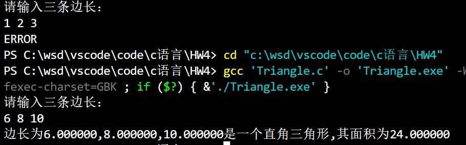
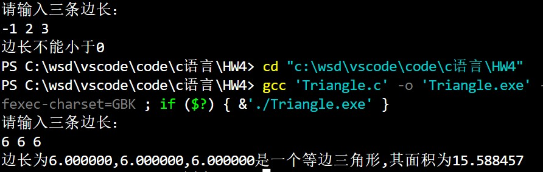
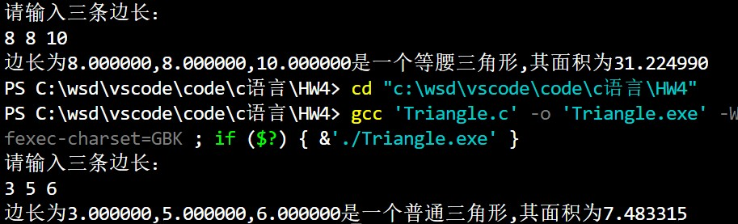
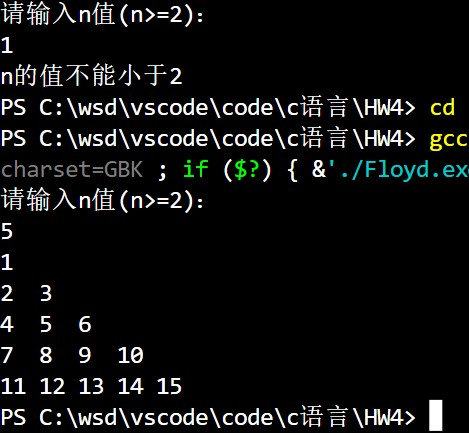
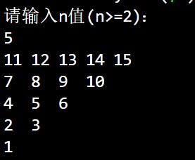
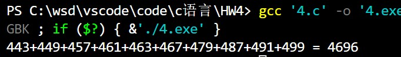

# <center>Homework4</center>


**<center>王世炟 PB20151796**</center>
**<center>2022/10/10</center>**

## 1、 三角形的判定

>输入 3 个数到变量 x,y 和 z，以空格分隔，以回车结束。编写程序判断这三个数能否构成三
角形，若能构成三角形，打印此三角形是什么类型的三角形（一般、等边、等腰还是直角三
角形等），并计算打印三角形的面积；若不能构成三角形则打印“Error”。

**样例：**

```
输入：输入三角形的 3 个边：3 4 5
输出：边长为 3.000000,4.000000,5.000000 的三角形是 直角三角形,其面积为:6.000000
```

**解答：**

判断三角形的类型可以用简单的`if`语句实现，而已知三条边求面积可以用到海伦公式：

$$
S=\sqrt{p * (p - x) * (p - y) * (p - z)},其中p=\frac{a+b+c}{2}
$$

```
#include <math.h>
#include <stdio.h>

int main()
{
    double x, y, z, p, s;
    printf("请输入三条边长：\n");
    scanf("%lf %lf %lf", &x, &y, &z);
    if (x < 0 || y < 0 || z < 0)
    {
        printf("边长不能小于0");
        return 0;
    }

    if (x + y > z && y + z > x && z + x > y)
    {
        if (x == y && y == z)
        {
            printf("边长为%lf,%lf,%lf是一个等边三角形", x, y, z);
        }
        else if (x == y || y == z || z == x)
        {
            printf("边长为%lf,%lf,%lf是一个等腰三角形", x, y, z);
        }
        else if (x * x + y * y == z * z || x * x + z * z == y * y || y * y + z * z == x * x)
        {
            printf("边长为%lf,%lf,%lf是一个直角三角形", x, y, z);
        }
        else
        {
            printf("边长为%lf,%lf,%lf是一个普通三角形", x, y, z);
        }
        p = (x + y + z) / 2;
        s = sqrt(p * (p - x) * (p - y) * (p - z));
        printf(",其面积为%lf\n", s);
    }
    else
    {
        printf("ERROR");
    }
}
```

**输出结果：**





## 2 、 打印弗洛伊德三角形。

>弗洛伊德三角形是由正整数序列排列组成的直角三角形（如下面的输出样例）。程序输入
n（n>=2），输出由 n 行数字构成的弗洛伊德三角形。

```
输入样例：4
输出样例：
1
2 3
4 5 6
7 8 9 10
```

**解答：**

弗洛伊德三角形的规律为每行的数字个数等于行数，所以使用两层`for`循环的同时，让一个变量自加即可。同时注意用`%-3d`进行左对齐、

```
#include <stdio.h>

int main()
{
    int n, k;
    k = 1;
    printf("请输入n值(n>=2)：\n");
    scanf("%d", &n);
    if (n<2)
    {
        printf("n的值不能小于2");
        return 0;
    }
    
    for (int i = 1; i <= n; i++)
    {
        for (int j = 1; j <= i; j++)
        {
            printf("%-3d", k);
            k++;
        }
        
        printf("\n");
    }
    return 0;
}
```

**输出结果：**



## 3、输出倒置的弗洛伊德三角形。

>续上题。输入 n 含义同上，输出倒置的弗洛伊德三角形，如下面输出样例所示。

```
输入样例：4
输出样例：
7 8 9 10
4 5 6
2 3
1
```

**解答：**

与上题不同，发现倒置三角的新规律，每行的最后一个数均为 $\frac{k(k+1)}{2}$,这时再减去本行数字个数-1即可得到行初值，即可完成输出。

```
#include <stdio.h>

int main()
{
    int n, k;
    printf("请输入n值(n>=2)：\n");
    scanf("%d", &n);
    if (n<2)
    {
        printf("n的值不能小于2");
        return 0;
    }
    for (int i = n; i >= 1; i--)
    {
        k = i * (i + 1) / 2;
        for (int j = i - 1; j >= 0; j--)
        {
            printf("%-3d", k - j);
        }
        
        printf("\n");
    }
    return 0;
}
```

**输出结果：**



## 4 、循环计算练习。

>输出 500 以内最大的 10 个素数并计算它们的和。\
1） 要求输出格式如下 (10 个素数为 P1..P10,和为Sum) :\
$$
P_1+P_2+P_3+...+P_{10} = Sum
$$
2） 循环控制结构中应包括无法找到 10 个素数的情况 （尽管 500 以内的素数大于 10 个）\
3） 由于大于 2 的偶数肯定不是素数，循环中不必对其进行判断。

**解答：**

如果一个数不能被小于它的所有素数整除，那么它就是一个素数。\
依据此原理可以用一个数组存储素数，并进行判断。

```
#include <stdio.h>

int main()
{
    int pri[500] = {0};
    int c = 1, j = 0;
    pri[0] = 2;
    for (int i = 1; (2 * i + 1) <= 500; i++)
    {
        for (j = 0; j < c; j++)
        {
            if ((2 * i + 1) % pri[j] == 0)
            {
                break;
            }
        }
        if (j == c)
        {
            c += 1;
            pri[c - 1] = 2 * i + 1;
        }
    }
    if (c < 10)
    {
        printf("没有10个素数");
    }
    else
    {
        int sum = 0;
        for (int n = c - 10; n < c - 1; n++)
        {
            printf("%d+", pri[n]);
            sum = sum + pri[n];
        }
        sum = sum + pri[c - 1];
        printf("%d = %d", pri[c - 1], sum);
    }
    return 0;
}
```

**输出结果：**

