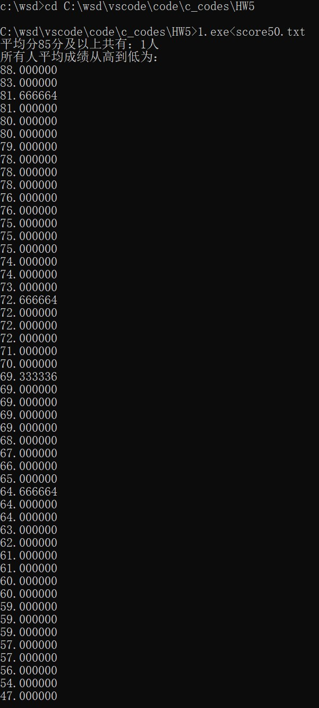
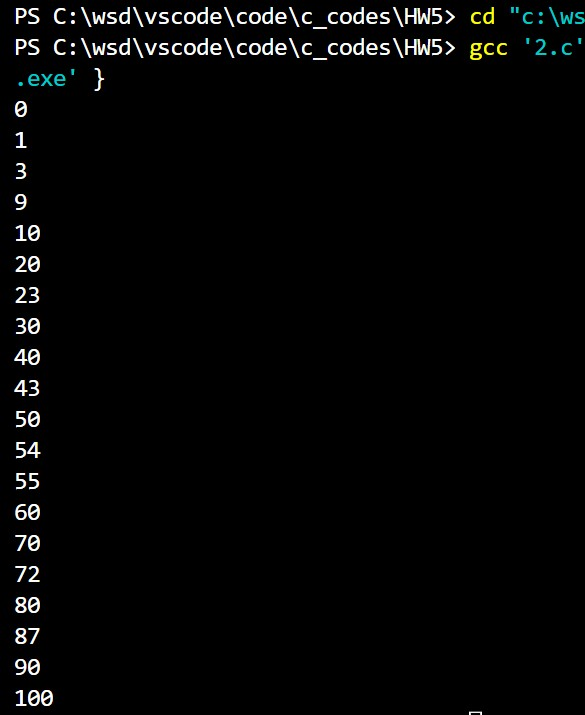
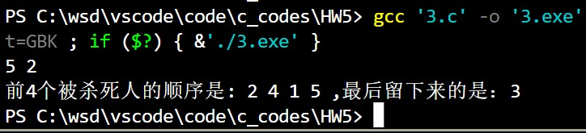

@import "D:\USR\vue.css"

# <center>Homework5</center>


**<center>王世炟 PB20151796**</center>
**<center>2022/10/19</center>**


循环 数组 排序

## 要求

- 在计算机上编程程序，加上必要的注释。
- 上机实验，经助教检查通过后，复制源码并记录实验结果，完成报告。
- 实验报告：记录调试及改错过程；知识点或方法技巧的收获心得.

## 1 、 成绩统计。

>一个班有 50 个学生，每个学生有三门课。输入全部成绩，并计算每个人三门课的平均成绩，统计平均 85 分及以上的人数，用冒泡排序法将平均成绩按照从高到低的顺序排序、并输出排序后的平均成绩。现有文本文件 `score50.txt`，使用输入重定向从该文件输入数据。

```
1 46 95 77
2 66 88 15
3 74 87 80
4 36 73 71
5 76 25 69
6 76 82 68
7 13 91 38
8 96 80 90
9 83 80 42
10 30 71 83
... ...
```

**源码**

写此作业时还未更改题目，于是完成了两种方法。


```c
#include <stdio.h>
#include <stdlib.h>

int main()
{
    //freopen("score50.txt", "r", stdin);//文件重定向时用到
    int ss[50][4];
    for (int i = 0; i < 50; i++)
    {
        for (int j = 0; j < 4; j++)
        {
            scanf("%d", &ss[i][j]);
        }
    }
    //fclose(stdin);//文件重定向时用到
    float s[50];
    for (int i = 0; i < 50; i++)
    {
        s[i] = (ss[i][1] + ss[i][2] + ss[i][3]) / 3.0;
    }
    //QuickSort
    int temp;
    for (int i = 0; i < 50 - 1; i++)
    {
        for (int j = 0; j < 50 - i - 1; j++)
        {
            if (s[j] < s[j + 1])
            {
                temp = s[j];
                s[j] = s[j + 1];
                s[j + 1] = temp;
            }
        }
    }
    //BinarySearch
    int low = 0, high = 49, mid = (low + high) / 2;
    int p;
    while (1)
    {
        if (s[mid] == 85)
        {
            if (s[mid + 1] == 85)
            {
                mid = mid + 1;
            }
            else
            {
                p = mid;
                break;
            }
        }
        else if (s[mid] < 85)
        {
            if (s[mid - 1] >= 85)
            {
                p = mid - 1;
                break;
            }
            else
            {
                high = mid;
                mid = (low + mid) / 2;
            }
        }
        else
        {
            low = mid;
            mid = (mid + high) / 2;
        }
    }
    //输出
    printf("平均分85分及以上共有：%d人\n", p + 1);
    printf("所有人平均成绩从高到低为：\n");
    for (int i = 0; i < 50; i++)
    {
        printf("%f\n", s[i]);
    }
    return 0;
}
```


**运行结果**

**文件重定向**：


**终端重定向**：




**实验报告**

将终端输入重定向为从文件输入。

## 2 、合并两个数组。

>现有数组 $int ~a[20], b[10]$ ; 对数组初始化: $a[0]..a[9]$ 中按照从小到大顺序存放了 $10$ 个整数：\
$\{10，20，30，40，50，60，70，80，90，100\}$，b 中有 10 个无序的整数
$\{1，43，72，23，9，87，54，3，55，0\}$。\
编程序，把 $b$ 中的数据合并到 $a$ 中，并保持 $a$ 数组仍然有序。然后输出 $a$ 。

**源码**

```
#include <stdio.h>

int main()
{
    int a[20] = {10, 20, 30, 40, 50, 60, 70, 80, 90, 100};
    int b[10] = {1, 43, 72, 23, 9, 87, 54, 3, 55, 0};
    int temp, i, j;
    for (i = 10; i < 20; i++)
    {
        a[i] = b[i - 10];
    }
    
    for (i = 0; i < 20; i++)
    {
        temp = a[i];
        for (j = i - 1; j >= 0 && a[j] > temp; j--)
        {
            a[j + 1] = a[j];
        }
        a[j + 1] = temp;
    }
    for (i = 0; i < 20; i++)
    {
        printf("%d\n", a[i]);
    }
    
    return 0;
}
```

**运行结果**



**实验报告**

此题就是插入排序的过程的一部分。

## 3 、 约瑟夫环

>约瑟夫(Josephus)问题是由古罗马的史学家约瑟夫提出的,他参加并记录了公元 $66-70$ 年犹太人反抗罗马的起义。约瑟夫作为一个将领带兵驻守裘达伯特城,在城市沦陷之后,他和 $40$ 多名将士在附近的一个洞穴中避难，将士们群情激奋地表示宁死不投降，于是约瑟夫提出自杀\
规则：\
所有 $n$ 个人围坐一圈，从第一个人开始从 $1$ 到 $m$ 报数，报到 $m$ 的人在战友协助下有尊严地结束其生命（嗯也就是杀了他），下一个人重新报数，依次执行，直到最后一人则英勇而悲壮地自杀。\
故事的结局是约瑟夫同志留到了最后，他决定去当一个历史学家记录战士们的英勇事迹。\
现在假设你就是约瑟夫，你也想当历史学家(乐)。所以你需要知道当给定 n 和 m 后,最后留下
来的人的编号是多少？
编程序，设置数组 $soldiers[100]$, 输入 $n (设n<=100)$ 和 $m$， 输出最后一个剩下的编号。

例如：

```
输入 n=5 m=2
前四个被杀死人的顺序是： 2, 4, 1, 5, 最后留下来的是 3
输出 3
```

**源码**

```
#include <stdio.h>

int main()
{
    int n, m;
    scanf("%d %d", &n, &m);
    int soldiers[n];
    int death[n];
    for (int j = 0; j < n; j++)
    {
        soldiers[j] = 1;
    }
    int temp = 0;
    int cnt = 0;
    int i = 0;
    printf("前%d个被杀死人的顺序是: ", n - 1);
    while (cnt < n)
    {
        if (i == (n))
            i = 0;
        if (soldiers[i] == 1)
        {
            temp++;
            if (temp == m)
            {
                temp = 0;
                soldiers[i] = 0;
                death[cnt] = i + 1;
                cnt++;
            }
        }
        i++;
    }
    for ( i = 0; i < n - 1; i++)
    {
        printf("%d ", death[i]);
    }
    printf(",最后留下来的是：%d", death[n - 1]);
}
```

**运行结果**



**实验报告**

根据题目意思一步一步来即可。