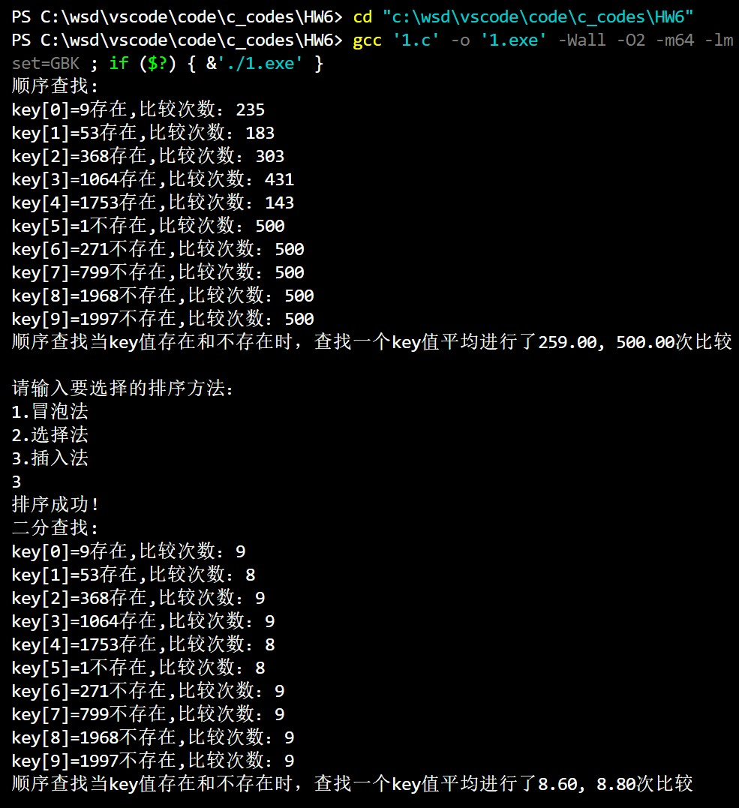

@import "D:\USR\vue.css"

# <center>Homework6</center>


**<center>王世炟 PB20151796**</center>
**<center>2022/10/25</center>**

<center>数组应用、查找和排序</center>

## 顺序查找和二分查找的比较

>以 1 为种子，（即 srand(1);）生成 500 个随机数，值域 [0 .. 1999]， 存放于数组 int data[500]中。\
另设定一个数组 int key[10] ={9,53,368,1064,1753 ,1 ,271,799,1968,1997 };\
完成以下任务：\
1). 用顺序查找的方法，在 500 个随机数中分别查找 key[0] .. key[9] ,输出各 key[i]值“存在”或”不存在”，并输出查找各 key[i]过程中分别进行了多少次比较。\
统计并输出： 查找到一个存在于 data 数组中的 key 值平均要进行多少次比较？

>2）. 输出提示让用户输入整数 1 或 2 或 3，读入该数字，然后分别对应使用下面三种排序算
法之一对 500 个随机数进行排序：
>- 1.冒泡法、
>- 2.选择法、
>- 3.插入法、

>3). 用二分查找的方法： 在排序后的 data 数组中分别查找 key[0] .. key[9] ,输出各 key[i]值“存在”或”不存在”，并输出查找各 key[i]过程中分别进行了多少次比较。\
统计并输出： 查找到一个存在于 data 数组中的 key 值平均要进行多少次比较？


## (一) 源码

```c
#include <stdio.h>
#include <stdlib.h>

void Swap(int *a, int *b) //交换两个数
{
    int temp = *a;
    *a = *b;
    *b = temp;
    return;
}

void BubbleSort(int a[], int n) //冒泡排序
{
    int flag;
    for (int i = n - 1; i > 0; --i)
    {
        for (int j = 0; j < i; j++)
        {
            flag = 1;
            if (a[j] > a[j + 1])
            {
                Swap(&a[j], &a[j + 1]);
                flag = 0;
            }
        }
        if (flag)
        {
            break;
        }
    }
    return;
}

void SelectSort(int a[], int n) //选择排序
{
    int flag;
    for (int i = 0; i < n; i++)
    {
        flag = i;
        for (int j = i; j < n; j++)
        {
            if (a[j] < a[flag])
            {
                flag = j;
            }
        }
        Swap(&a[i], &a[flag]);
    }
    return;
}

void InsertSort(int a[], int n) //插入排序
{
    int temp, i, j;
    for (i = 0; i < n; i++)
    {
        temp = a[i];
        for (j = i - 1; j >= 0 && a[j] > temp; j--)
        {
            a[j + 1] = a[j];
        }
        a[j + 1] = temp;
    }
    return;
}

int main()
{
    int flag, left, right, mid;
    int data[500];
    int key[10] = {9, 53, 368, 1064, 1753, 1, 271, 799, 1968, 1997};
    srand(1);
    for (int i = 0; i < 500; i++)
    {
        data[i] = rand() % 2000;
    }
    printf("顺序查找:\n");
    int cmp[10] = {0, 0, 0, 0, 0, 0, 0, 0, 0, 0};
    float cmp1 = 0, cmp2 = 0;
    int cnt = 0, j;
    for (int i = 0; i < 10; i++)
    {
        for (j = 0; j < 500; j++)
        {
            cmp[i] += 1;
            if (key[i] == data[j])
            {
                break;
            }
        }
        if (j == 500)
        {
            cmp2 = cmp2 + cmp[i];
            cnt += 1;
            printf("key[%d]=%d不存在,比较次数：%d\n", i, key[i], cmp[i]);
        }
        else
        {
            cmp1 = cmp1 + cmp[i];
            printf("key[%d]=%d存在,比较次数：%d\n", i, key[i], cmp[i]);
        }
    }
    cmp2 = cmp2 / cnt;
    cmp1 = cmp1 / (10 - cnt);
    printf("顺序查找当key值存在和不存在时，查找一个key值平均进行了%.2f, %.2f次比较\n\n", cmp1, cmp2);
    printf("请输入要选择的排序方法：\n");
    printf("1.冒泡法\n"
           "2.选择法\n"
           "3.插入法\n");
    scanf("%d", &flag);
    switch (flag)
    {
    case 1:
        BubbleSort(data, 500);
        break;

    case 2:
        SelectSort(data, 500);
        break;

    case 3:
        InsertSort(data, 500);
        break;

    default:
        printf("wrong number!");
        return 0;
        break;
    }
    printf("排序成功！\n");
    printf("二分查找:\n");
    int cmpB[10] = {0, 0, 0, 0, 0, 0, 0, 0, 0, 0};
    int find;
    cmp1 = 0;
    cmp2 = 0;
    cnt = 0;
    for (int i = 0; i < 10; i++)
    {
        find = 0;
        left = 0;
        right = 499;
        while (left <= right)
        {
            cmpB[i]++;
            mid = (left + right) / 2;
            if (data[mid] > key[i])
            {
                right = mid - 1;
            }
            else if (data[mid] < key[i])
            {
                left = mid + 1;
            }
            else
            {
                find = 1;
                cmp1 += cmpB[i];
                cnt++;
                printf("key[%d]=%d存在,比较次数：%d\n", i, key[i], cmpB[i]);
                break;
            }
        }
        if (!find)
        {
            cmp2 += cmpB[i];
            printf("key[%d]=%d不存在,比较次数：%d\n", i, key[i], cmpB[i]);
        }
    }
    cmp2 = cmp2 / cnt;
    cmp1 = cmp1 / (10 - cnt);
    printf("顺序查找当key值存在和不存在时，查找一个key值平均进行了%.2f, %.2f次比较\n\n", cmp1, cmp2);

    return 0;
}
```

## (二) 运行结果



## (三) 实验报告

本次作业要求我们实现顺序查找和二分查找，深切体会了 $O(n)与O(\log n)$ 的运行效率的不同。