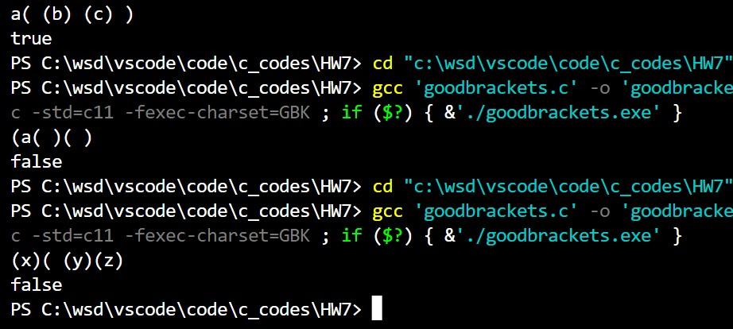
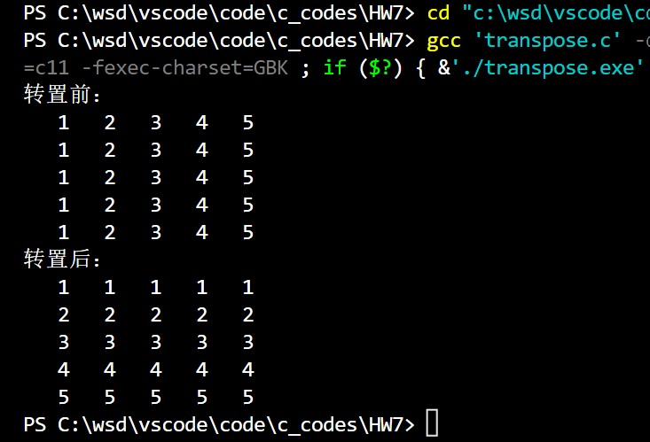
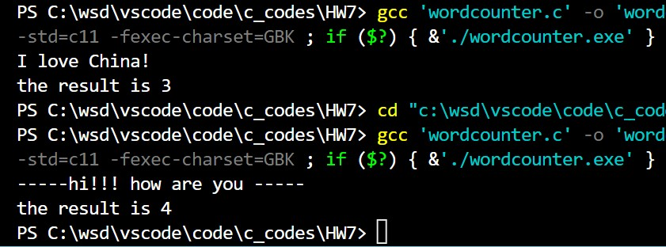
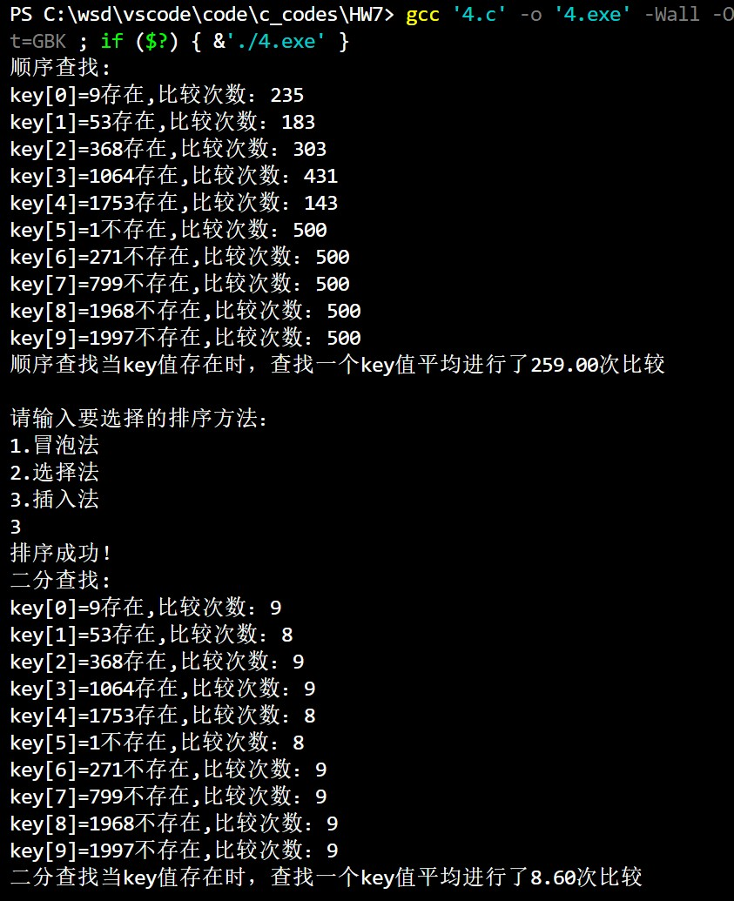

@import "D:\USR\vue.css"

# <center>Homework7</center>


**<center>王世炟 PB20151796**</center>
**<center>2022/11/02</center>**

<center>函数</center>

## 1 、合法括号序列

>一个字符串里含有一些小括号，包括左括号‘(’和右括号’)’。合法的序列形式中左、右括号的数
量是相同的，每一对匹配的括号中总是左括号在前右括号在后，自左向右读取的时候不会出现未匹配的右括号。\
请编写一个函数判断字符串中的括号是否是合法的序列 ，函数原型如下：\
`int goodbrackets( char str[]);`  
当 str 是合法括号序列时函数返回 1，否则返回 0；  
在 main 函数中输入带括号的字符串，调用函数进行判断，根据函数返回值，在 main 函数中输出 true(表示合法) 和 false（表示非法）。(只考虑小括号字符构成的序列是否合法，其他字符可以忽略不计)。

**测试样例：**

```c
输入：a( (b) (c) )
输出：true
测试样例：
输入：(a( )( )
输出：false
测试样例：
输入：(x)( (y)(z)
输出：false
```

**源码**

```c
#include <stdio.h>

int goodbrackets( char str[])
{
    int i = 0, count = 0;
    while (str[i] != '\0')
    {
        if (str[i]=='(')
        {
            count++;
        }
        else if (str[i] == ')')
        {
            count--;
        }
        if (count < 0)
        {
            return 0;
        }
        i++;
    }
    if (count == 0)
    {
        return 1;
    }
    return 0;
}

int main()
{
    int flag;
    char str[50];
    gets(str);
    flag = goodbrackets(str);
    if (flag)
    {
        printf("true");
    }
    else
    {
        printf("false");
    }
    return 0;
}
```

**运行结果**



**实验报告**

本题也可以用栈实现，左括号进栈，右括号出栈，最后栈空即合法。

## 2 、 求转置矩阵（用函数实现）

>在主函数中对一个 5x5 大小的二维数组初始化，表示一个 5x5 的方阵，如下：  
1 2 3 4 5  
1 2 3 4 5  
1 2 3 4 5  
1 2 3 4 5  
1 2 3 4 5  
定义函数实现矩阵转置， `void transpose( int matrix[][5] );`  
并在主函数中调用，将上述矩阵进行转置， 输出转置之后的形式。


**源码**

```c
#include <stdio.h>

void transpose(int matrix[][5])
{
    int t;
    for (int i = 0; i < 5; i++)
    {
        for (int j = 0; j < i; j++)
        {
            t = matrix[i][j];
            matrix[i][j] = matrix[j][i];
            matrix[j][i] = t;
        }
    }
    return;
}

int main()
{
    int matrix[5][5] = {{1, 2, 3, 4, 5}, {1, 2, 3, 4, 5}, {1, 2, 3, 4, 5}, {1, 2, 3, 4, 5}, 
                        {1, 2, 3, 4, 5}};
    printf("转置前：\n");
    for (int i = 0; i < 5; i++)
    {
        for (int j = 0; j < 5; j++)
        {
            printf("%4d", matrix[i][j]);
        }
        printf("\n");
    }
    transpose(matrix);
    printf("转置后：\n");
    for (int i = 0; i < 5; i++)
    {
        for (int j = 0; j < 5; j++)
        {
            printf("%4d", matrix[i][j]);
        }
        printf("\n");
    }
    return 0;
}
```

**运行结果**



**实验报告**

只需要对一班元素进行与对称元素交换即可。

## 3. 统计单词个数

>我们把单词定义为由连续英文字母构成的字符串。  
编写程序输入一行字符串，长度不超过 100 个字符。编写函数对这个字符串进行统计，返回单词的个数。  
函数原型： `int wordcounter( char str[ ] );`  
在 main 函数中输出单词个数。

```c
样例输入：
I love China!
样例输出： 3
样例输入：
-----hi!!! how are you -----
样例输出： 4
```


**源码**

```c
#include <stdio.h>

int wordcounter(char str[])
{
    int i = 0;
    int cnt = 0, word = 0;
    while (str[i] != '\0')
    {
        if (!((str[i] >= 'a' && str[i] <= 'z') || (str[i] >= 'A' && str[i] <= 'Z')))
        {
            word = 0; //状态置为0
        }
        else if (word == 0)
        {
            word = 1;
            cnt += 1;
        }
        i++;
    }
    return cnt;
}

int main()
{
    int result;
    char str[100];
    gets(str);
    result = wordcounter(str);
    printf("the result is %d", result);
    return 0;
}
```

**运行结果**



**实验报告**

## 4. 改写作业 6 中的程序，用函数实现排序和查找。
>在 main 函数中，以 1 为种子，（即 `srand(1);`）生成 $500$ 个随机数，值域 $[0 .. 1999]$， 存放于数组 `int data[500]` 中。 另设定一个数组 `int key[10] ={9,53,368,1064,1753,1,271,799,1968,1997 };`   
用函数完成顺序查找、三种排序、二分查找。  
在 main 函数中:  
调用顺序查找函数并输出其返回值（如下 a.）；  
输出提示让用户输入整数 1 或 2 或 3，  
读入该数字，调用三种排序函数之一对 data 数组进行排序(如下 b.) ;  
然后调用二分查找函数并输出其返回
值（如下 c.）。  

>a). 顺序查找函数：
在 500 个随机数中分别查找 key[0] ... key[9] ,
输出各 key[i]值“存在”或”不存在”输出查找各 key[i]过程中分别进行了多少次比较，  
返回值：查找到一个存在于 data 数组中的 key 值平均要进行比较的次数。  

>b）排序函数（三个）  
对 500 个随机数进行排序：
>1. 冒泡法、
>2. 选择法、
>3. 插入法
>无返回值。  

>c). 用二分查找的方法： 在排序后的 data 数组中分别查找 key[0] .. key[9] ,
输出各 key[i]值“存在”或”不存在”，并输出查找各 key[i] 过程中分别进行了多少次比较。
返回值： 查找到一个存在于 data 数组中的 key 值平均要进行比较的次数。


**源码**

```c
#include <stdio.h>
#include <stdlib.h>

void Swap(int *a, int *b) //交换两个数
{
    int temp = *a;
    *a = *b;
    *b = temp;
    return;
}

void BubbleSort(int a[], int n) //冒泡排序
{
    for (int i = n - 1; i > 0; --i)
    {
        for (int j = 0; j < i; j++)
        {
            if (a[j] > a[j + 1])
            {
                Swap(&a[j], &a[j + 1]);
            }
        }
    }
    return;
}

void SelectSort(int a[], int n) //选择排序
{
    int flag;
    for (int i = 0; i < n; i++)
    {
        flag = i;
        for (int j = i; j < n; j++)
        {
            if (a[j] < a[flag])
            {
                flag = j;
            }
        }
        Swap(&a[i], &a[flag]);
    }
    return;
}

void InsertSort(int a[], int n) //插入排序
{
    int temp, i, j;
    for (i = 0; i < n; i++)
    {
        temp = a[i];
        for (j = i - 1; j >= 0 && a[j] > temp; j--)
        {
            a[j + 1] = a[j];
        }
        a[j + 1] = temp;
    }
    return;
}

float OrderSearch(int data[], int key[])
{
    printf("顺序查找:\n");
    int cmp[10] = {0, 0, 0, 0, 0, 0, 0, 0, 0, 0};
    float cmp1 = 0, cmp2 = 0;
    int cnt = 0, j;
    for (int i = 0; i < 10; i++)
    {
        for (j = 0; j < 500; j++)
        {
            cmp[i] += 1;
            if (key[i] == data[j])
            {
                break;
            }
        }
        if (j == 500)
        {
            cmp2 = cmp2 + cmp[i];
            cnt += 1;
            printf("key[%d]=%d不存在,比较次数：%d\n", i, key[i], cmp[i]);
        }
        else
        {
            cmp1 = cmp1 + cmp[i];
            printf("key[%d]=%d存在,比较次数：%d\n", i, key[i], cmp[i]);
        }
    }
    cmp1 = cmp1 / (10 - cnt);
    return cmp1;
}

void Sort(int data[])
{
    int flag;
    printf("请输入要选择的排序方法：\n");
    printf("1.冒泡法\n"
           "2.选择法\n"
           "3.插入法\n");
    scanf("%d", &flag);
    switch (flag)
    {
    case 1:
        BubbleSort(data, 500);
        break;

    case 2:
        SelectSort(data, 500);
        break;

    case 3:
        InsertSort(data, 500);
        break;

    default:
        printf("wrong number!");
        return;
        break;
    }
    printf("排序成功！\n");
    return;
}

float BinarySearch(int data[], int key[])
{
    int left, right, mid, find;
    int cmpB[10] = {0, 0, 0, 0, 0, 0, 0, 0, 0, 0};
    float cmp1 = 0, cmp2 = 0;
    int cnt = 0;
    printf("二分查找:\n");
    for (int i = 0; i < 10; i++)
    {
        find = 0;
        left = 0;
        right = 499;
        while (left <= right)
        {
            cmpB[i]++;
            mid = (left + right) / 2;
            if (data[mid] > key[i])
            {
                right = mid - 1;
            }
            else if (data[mid] < key[i])
            {
                left = mid + 1;
            }
            else
            {
                find = 1;
                cmp1 += cmpB[i];
                cnt++;
                printf("key[%d]=%d存在,比较次数：%d\n", i, key[i], cmpB[i]);
                break;
            }
        }
        if (!find)
        {
            cmp2 += cmpB[i];
            printf("key[%d]=%d不存在,比较次数：%d\n", i, key[i], cmpB[i]);
        }
    }
    cmp1 = cmp1 / (10 - cnt);
    return cmp1;
}

int main()
{
    float order, binary;
    int data[500];
    int key[10] = {9, 53, 368, 1064, 1753, 1, 271, 799, 1968, 1997};
    srand(1);
    for (int i = 0; i < 500; i++)
    {
        data[i] = rand() % 2000;
    }
    order = OrderSearch(data, key);
    printf("顺序查找当key值存在时，查找一个key值平均进行了%.2f次比较\n\n", order);
    Sort(data);
    binary = BinarySearch(data, key);
    printf("二分查找当key值存在时，查找一个key值平均进行了%.2f次比较\n\n", binary);
    return 0;
}
```

**运行结果**



**实验报告**

做好参量的传递即可。