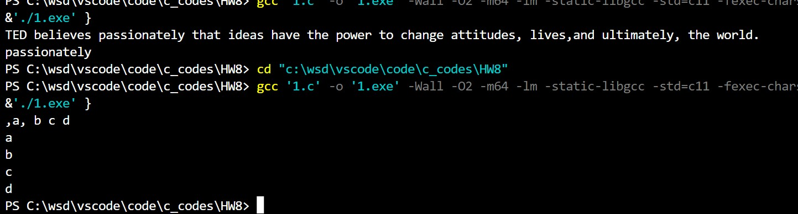
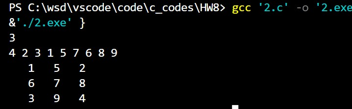

@import "D:\USR\vue.css"

# <center>Homework8</center>


**<center>王世炟 PB20151796**</center>
**<center>2022/11/09</center>**

<center>指针</center>


## 1 、 
>输入一行文字（长度<=200），找出其中最长的单词并输出（若有多个则输出多个）。

```
输入样例:
TED believes passionately that ideas have the power to change attitudes, lives,
and ultimately, the world.
输出样例： passionately
```

**源码**

```c
#include <stdio.h>

int main()
{
    char c[200];
    gets(c);
    int end[200];
    int len[200] = {0}, maxlen = 0;
    int i = 0, j = 0;
    int cnt;
    while (*(c + i))
    {
        if (!(*(c + i) >= 'a' && *(c + i) <= 'z') || (*(c + i) >= 'A' && *(c + i) <= 'Z'))
        {
            if (*(len + j) > maxlen)
            {
                maxlen = *(len + j);
            }
            *(end + j) = i;
            j++;
        }
        else
        {
            *(len + j) += 1;
        }
        i++;
    }
    *(end + j) = i;
    cnt = j;
    i = 0;
    for (i = 0; i <= cnt; i++)
    {
        if (*(len + i) == maxlen)
        {
            for (j = *(end + i) - maxlen; j < *(end + i); j++)
            {
                printf("%c", *(c + j));
            }
            printf("\n");
        }
    }
    return 1;
}
```

**运行结果**



**实验报告**

本题多用几个数组多存储信息即可。

## 2 、 
>将 nxn 方阵中的前 4 个最小元素放置到四个角。
要求：
1) 设计一个函数，实现将任意的 nxn 方阵（n>=3）的前四个最小元
素放置到方阵四个角的位置（顺序为：左上、右上、左下、右
下）；元素集合不变，四角之外的其余元素位置不作限制。 函数
原型 `void min4Corner( int * address, int n)；`
2) 在主函数中输入 n，然后输入 n2 个整数，调用上述 min4Corner 函
数，然后输出处理后的方阵。

```
输入样例：
3
4 2 3 1 5 7 6 8 9
输出样例：
1 6 2
9 5 7
3 8 4
```


**源码**

```c
#include <stdio.h>

// int temp[100][100];
void Swap(int *a, int *b) //交换两个数
{
    int temp = *a;
    *a = *b;
    *b = temp;
    return;
}

void BubbleSort(int *a, int n) //冒泡排序
{
    for (int i = n - 1; i > 0; --i)
    {
        for (int j = 0; j < i; j++)
        {
            if (*(a + j) > *(a + j + 1))
            {
                Swap(a + j, a + j + 1);
            }
        }
    }
    return;
}
/*
void min4Corner(int *address, int n)
{
    int k = 4;
    BubbleSort(address, n * n);
    **temp = *address;
    *(*(temp) + n - 1) = *(address + 1);
    *(*(temp + n - 1)) = *(address + 2);
    *(*(temp + n - 1) + n - 1) = *(address + 3);
    for (int i = 0; i < n; i++)
    {
        for (int j = 0; j < n; j++)
        {
            if (((i == 0) && (j == 0)) || ((i == 0) && (j == n - 
            1)) || ((i == n - 1) && (j == 0)) || ((i == n - 1) && (j == n - 1)))
            {
                continue;
                ;
            }
            else
            {
                *(*(temp + i) + j) = *(address + k);
                k++;
            }
        }
    }
}
*/

void min4Corner(int *address, int n)
{
    int temp[10000];
    int j = 4;
    BubbleSort(address, n * n);
    *temp = *address;
    *(temp + n - 1) = *(address + 1);
    *(temp + n * (n - 1)) = *(address + 2);
    *(temp + n * n - 1) = *(address + 3);

    for (int i = 0; i < n * n; i++)
    {
        if ((i != 0) && (i != n - 1) && (i != n * (n - 1)) && (i != 
        n * n - 1))
        {
            *(temp + i) = *(address + j);
            j++;
        }
    }
    for (int i = 0; i < n * n; i++)
    {
        *(address + i) = *(temp + i);
    }
    return;
}

int main()
{
    int address[10000];
    int n;
    scanf("%d", &n);
    for (int i = 0; i < n * n; i++)
    {
        scanf("%d", address + i);
    }
    min4Corner(address, n);
    /*
    for (int i = 0; i < n; i++)
    {
        for (int j = 0; j < n; j++)
        {
            printf("%4d", *(*(temp + i) + j));
        }
        printf("\n");
    }
    */

    for (int i = 0; i < n; i++)
    {
        for (int j = 0; j < n; j++)
        {
            printf("%4d", *(address + i * n + j));
        }
        printf("\n");
    }

    return 0;
}
```

**运行结果**



**实验报告**

写完用二维数组储存才想起来可以直接用一维数组存，就又写了一个一维版本。

本题做法：先排序，把前四个数放好位置，再放其他数。