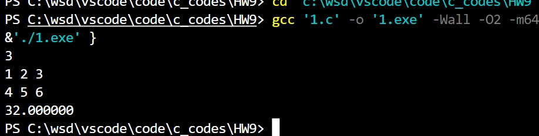
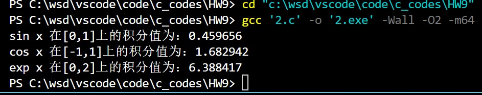

@import "D:\USR\vue.css"

# <center>Homework9</center>


**<center>王世炟 PB20151796**</center>
**<center>2022/11/16</center>**

<center>指针</center>

**要求:** 本次作业程序要求用指针实现

## 1 、

>求两个向量的内积。

说明：
有两个向量 $a$ 和 $b$, $a = [a1, a2,..., an], b = [b1, b2,..., bn], a$ 和 $b$ 的内积定义为：
$a·b = a1*b1+a2*b2+......+an*bn$

编写函数，使用指针实现两个向量的内积的计算。要求函数中不出现下标运算[ ]。
在 `main()` 函数中，输入维数 `n`， 用 `malloc` 函数为两个 `n` 维向量分配内存（向量为实数向量）。并分别输
入两个向量。调用函数计算内积并返回主函数，在主函数中输出结果。
```c
输入样例：
3
1 2 3
4 5 6
输出样例：
32.000000
```

**源码**

```c
#include <stdio.h>
#include <stdlib.h>

double Inner(double *a, double *b, int n)
{
    double inner = 0;
    for (int i = 0; i < n; i++)
    {
        inner += *(a + i) * *(b + i);
    }
    return inner;
}

int main()
{
    int n;
    double *a, *b;
    double inner;
    scanf("%d", &n);
    a = (double *)malloc(n * sizeof(double));
    b = (double *)malloc(n * sizeof(double));
    for (int i = 0; i < n; i++)
    {
        scanf("%lf", &*(a + i));
    }
    for (int i = 0; i < n; i++)
    {
        scanf("%lf", &*(b + i));
    }
    inner = Inner(a, b, n);
    printf("%lf", inner);
}
```

**运行结果**



**实验报告**

练习使用 `malloc()`


## 2 、

>使用指向函数的指针实现。在 main 函数中输出三个定积分结果。
$$
\int_0^1\sin xdx, ~~\int_{-1}^1\cos xdx,~~ \int_0^2 e^xdx
$$

**源码**

```c
#include <stdio.h>
#include <math.h>

#define N 10000

double Integral(double a, double b, double (*fun)(double))
{
    double sum = 0, x = a;
    double h = (b - a) / N;
    for (int i = 0; i < N; i++)
    {
        sum += h * (*fun)(x);
        x += h;
    }
    return sum;
}

int main()
{
    double (*p)(double, double, double (*fun)(double)) = Integral;
    printf("sin x 在[0,1]上的积分值为：%lf\n", (*p)(0, 1, sin));
    printf("cos x 在[-1,1]上的积分值为：%lf\n", (*p)(-1, 1, cos));
    printf("exp x 在[0,2]上的积分值为：%lf\n", (*p)(0, 2, exp));
    return 0;
}
```

**运行结果**



**实验报告**

使用的是下界估计，即以左端点作为矩形的高(将区间分成了10000份)。